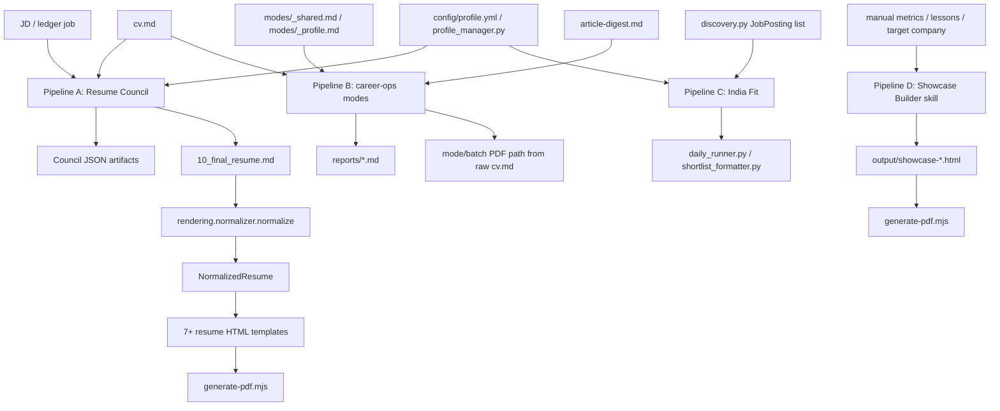
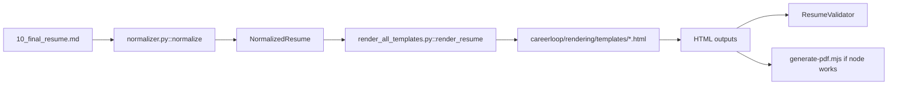
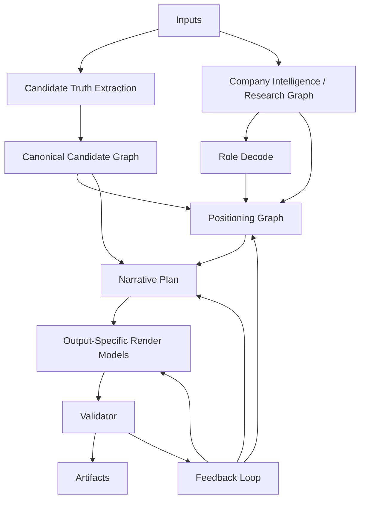

# CareerLoop Redesign Implementation Plan

**Date:** 2026-05-19  
**Scope:** Engineering blueprint for the next CareerLoop refactor  
**Source documents read fully:**
- `Pipeline Audit may 20/PROMPT_AUDIT.md`
- `Pipeline Audit may 20/pipeline_graph.md`
- `Pipeline Audit may 20/FUNCTIONAL_STABILIZATION_REPORT.md`
- `docs/FUNCTIONAL_STABILIZATION_REPORT.md` as the newer stabilization status report

**Status:** Plan only. No implementation, prompt rewrites, or template redesigns are included here.

---

## Section 1 - Executive Summary

CareerLoop has evolved into a useful but fragmented career execution system. The current system can parse a CV, run a Resume Council, tailor resume content, humanize output, render multiple resume templates, scan jobs, score opportunities, and generate showcase pages. The problem is not lack of capability. The problem is that these capabilities are not connected by one canonical professional identity layer.

What is broken today:

- Resume Council, career-ops mode prompts, India Fit, and Showcase Builder are separate pipelines.
- Resume output is still often treated as the core primitive, even though the product vision requires a reusable professional identity layer.
- Some downstream outputs still depend on raw markdown or ad hoc agent generation instead of structured render models.
- Prompt outputs can be schema-less or only partially validated.
- Company intelligence exists, but is still too shallow and optionally grounded.
- Portfolio and showcase outputs regenerate from user-provided prose instead of the same candidate truth used by resumes.
- Feedback changes are not represented as structured preferences; they tend to become one-off edits.
- Metrics, proof points, tone, and visual style can drift across artifacts.

What stabilization already fixed:

- `careerloop/council/orchestrator.py` now calls `careerloop/rendering/render_all_templates.py::render_resume()` after Council artifact save.
- `careerloop/rendering/render_all_templates.py` now exposes a callable render entry point.
- `output/council/{person}/{job}/10_final_resume.md` now feeds the normalizer and HTML renderers during Council runs.
- `output/council/{person}/{job}/11_render_metadata.json` records render inventory.
- `careerloop/council/schemas.py` exists and defines node contracts for Company Intelligence, Role Decode, User Truth, Positioning Strategy, Section Rewrites, Cover Note, and Recruiter Message.
- `careerloop/council/graph.py` now validates S3, S5, S6, and S7 payloads and strips `private_constraints`.
- S7 now uses a per-section edit spec with `allowed_to_edit`.
- `careerloop/council/company_research.py` now provides a grounding adapter with sources, gaps, fetched time, and `grounding_status`.
- `careerloop/rendering/normalizer.py` includes encoding repair and collapsed bullet/table mitigation.
- `careerloop/rendering/validator.py` is wired into the render path.
- `tests/test_stabilization.py` and updated normalizer tests cover the stabilization fixes.
- `docs/FUNCTIONAL_STABILIZATION_REPORT.md` reports 31/31 passing stabilization tests.

What remains broken:

- The audit-folder stabilization report is stale and still marks fixes as pending; `docs/FUNCTIONAL_STABILIZATION_REPORT.md` is the newer source.
- Pipeline B (`modes/pdf.md`, `batch/batch-prompt.md`, in-context agent PDF generation) can still bypass Council and structured render contracts.
- Showcase Builder still consumes user inputs and template instructions directly, not a structured candidate graph.
- Company research is a useful adapter, not yet a durable company intelligence subsystem with source store, cache policy, confidence model, and fact/inference separation enforced across consumers.
- `NormalizedResume` is a strong resume render contract, but it is not a full professional identity contract.
- Humanizer can still operate on full text blobs in places where field-level mutation would be safer.
- Validators still need lifecycle placement, fail/warn policy, and regression fixtures beyond resume rendering.
- Feedback has no durable structured home.
- Output artifacts are not fully reproducible from a single run manifest.

Why redesign is needed:

CareerLoop should become professional identity infrastructure. Resume is one rendering mode. The core primitive should be a canonical candidate graph with evidence, metrics, provenance, confidence, and audience-specific positioning derived from it. Every output should be rendered from structured models, not from loose markdown or freeform regenerated copy.

What the redesign will achieve:

- One canonical candidate identity graph powers ATS resume, human resume, founder resume, portfolio page, showcase page, recruiter outreach, cover notes, interview prep, and application narratives.
- Company intelligence becomes grounded, cached, source-attributed, and reusable.
- Role decode and positioning become structured graph transformations.
- Narrative is generated from evidence and constraints, not from prompt improvisation.
- Renderers consume output-specific render models only.
- Humanizer becomes a safe field-level rewriting layer.
- Validators run throughout the lifecycle, not only at the end.
- User feedback updates presentation strategy, not source truth.
- Current workflows keep working through compatibility shims while internals migrate.

What will not be changed immediately:

- No full rewrite of Resume Council.
- No replacement of current resume templates.
- No immediate prompt rewrite.
- No immediate showcase visual redesign.
- No removal of `cv.md` as an onboarding/user source.
- No removal of existing CLI workflows.
- No breaking change to current `run_council.py`, `run_council_v3.py`, `generate-pdf.mjs`, `modes/`, or `batch/` entry points during P0/P1.

---

## Section 2 - Current System Map

The current architecture has four major pipelines.



### Pipeline A - Resume Council

Primary files:

- `run_council.py`
- `run_council_v3.py`
- `careerloop/council/orchestrator.py`
- `careerloop/council/context.py`
- `careerloop/profile_manager.py`
- `careerloop/council/graph.py`
- `careerloop/council/compiler.py`
- `careerloop/council/truth_guard.py`
- `careerloop/council/humanizer.py`
- `careerloop/council/llm.py`
- `careerloop/council/models.py`
- `careerloop/council/schemas.py`
- `careerloop/council/company_research.py`

Current Council state:

- `job_id`
- `person_id`
- `job_title`
- `company`
- `job_url`
- `jd_text`
- `master_cv`
- `profile`
- `today`
- `canonical_resume`
- `preservation_contract`
- `company_intelligence`
- `role_decode`
- `user_truth`
- `positioning_strategy`
- `section_rewrites`
- `application_pack`
- `errors`

Current Council stages:

| Stage | Function | File | Type | Input | Output |
|---|---|---|---|---|---|
| S1 Parse | `parse_node()` | `careerloop/council/graph.py` | deterministic | `master_cv` | `canonical_resume` |
| S2 Contract | `contract_node()` | `careerloop/council/graph.py` | deterministic | `canonical_resume`, `profile` | `preservation_contract` |
| S3 Company Intelligence | `company_intelligence_node()` | `careerloop/council/graph.py` | LLM + adapter | company, JD, website/manual if available | `company_intelligence` |
| S4 Role Decode | `role_decode_node()` | `careerloop/council/graph.py` | LLM | JD + company intelligence | `role_decode` |
| S5 User Truth | `user_truth_node()` | `careerloop/council/graph.py` | LLM | canonical resume + role decode | `user_truth` |
| S6 Positioning | `positioning_node()` | `careerloop/council/graph.py` | LLM | company intel + role decode + user truth | `positioning_strategy` |
| S7 Section Rewrites | `section_rewrites_node()` | `careerloop/council/graph.py` | LLM | per-section spec + strategy + truth | `section_rewrites` |
| S7.5 Truth Guard | `truth_guard_node()` | `careerloop/council/graph.py` | deterministic | rewrites + truth | repaired rewrites |
| S8 Assembly | `assembly_node()` | `careerloop/council/graph.py` | deterministic + LLM + humanizer | resume sections + rewrites + strategy | `application_pack` |

Current Council artifacts:

- `00_input_snapshot.json`
- `01_canonical_resume.json`
- `02_preservation_contract.json`
- `03_company_intelligence.json`
- `04_role_decode.json`
- `05_user_truth.json`
- `06_positioning_strategy.json`
- `07_section_rewrites.json`
- `08_truth_guard_report.json` in newer runs
- `10_final_resume.md`
- `11_cover_note.md`
- `11_render_metadata.json` in stabilized runs
- `15_quality_report.md`
- `16_user_review_summary.md`
- `17_council_run_log.json`

Current Resume Council render path:



Where markdown enters:

- `cv.md` is parsed by `ResumeCompiler.parse_markdown()`.
- `10_final_resume.md` is still a markdown intermediate.
- Cover note and quality report are markdown/text artifacts.

Where JSON exists:

- Council stage outputs are persisted as JSON.
- LLM node outputs are parsed as JSON by `CouncilLLMClient.complete_json()`.
- `careerloop/council/schemas.py` validates key Council node payloads.

Where schemas are missing or incomplete:

- Schemas are currently Python dict contracts, not JSON Schema files.
- `CanonicalResume`, `PreservationContract`, and `ApplicationPack` are dataclasses, but not persisted with external schema files.
- Render models for portfolio, showcase, outreach, cover notes, and interview prep do not exist yet.
- Validation report has no canonical schema.

Where validators run:

- `TruthGuard.validate()` and repair run before assembly.
- `ResumeCompiler._verify_links_preserved()` runs during assembly.
- `ResumeCompiler.generate_quality_report()` runs during assembly.
- `validate_payload()` runs after several LLM nodes.
- `ResumeValidator` runs during `render_resume()` for each HTML template.
- Tests in `tests/test_stabilization.py`, `tests/test_normalizer.py`, `careerloop/rendering/regression_test.py`, and root test files validate pieces of the behavior.

### Pipeline B - career-ops Skill / Mode Pipeline

Primary files:

- `AGENTS.md`
- `modes/_shared.md`
- `modes/_profile.md`
- `modes/pdf.md`
- `modes/oferta.md`
- `modes/ofertas.md`
- `modes/pipeline.md`
- `modes/auto-pipeline.md`
- `modes/apply.md`
- `modes/deep.md`
- `modes/interview-prep.md`
- `modes/project.md`
- `modes/training.md`
- `batch/batch-prompt.md`
- `templates/cv-template.html`
- `generate-pdf.mjs`
- `merge-tracker.mjs`
- `data/applications.md` if present
- `batch/tracker-additions/*.tsv`

Current stages:

1. Agent reads user layer files: `cv.md`, `config/profile.yml`, `modes/_profile.md`, `article-digest.md`, and often `portals.yml`.
2. Agent reads system prompt/mode files.
3. Agent acquires JD via browser/Playwright or fallback fetch.
4. Agent evaluates Blocks A-G.
5. Agent writes markdown report to `reports/`.
6. Agent generates PDF by following `modes/pdf.md` or `batch/batch-prompt.md`.
7. Agent writes TSV tracker addition.
8. `merge-tracker.mjs` merges tracker additions.

Key issue:

- This path can read `cv.md` directly and produce final HTML/PDF without Council, `NormalizedResume`, schema validation, Truth Guard, or render validation.

### Pipeline C - India Fit Engine

Primary files:

- `careerloop/discovery.py`
- `careerloop/india_fit_engine.py`
- `careerloop/india_fit_llm.py`
- `careerloop/profile_manager.py`
- `careerloop/daily_runner.py`
- `careerloop/shortlist_formatter.py`
- `careerloop/metrics.py`
- `careerloop/function_probability.py`
- `careerloop/sources/*.py`

Current flow:

1. Discovery adapters produce `JobPosting` objects.
2. Profile manager loads user profile.
3. `LLMIndiaFitEngine.score_batch()` scores each job.
4. DeepSeek returns JSON with scores and recommendation.
5. Jobs are sorted and rendered into a shortlist.

Current artifacts:

- Dry-run markdown/JSON files under `test data/output/`
- `careerloop/ledger.json`
- SQLite state in `careerloop/careerloop.db`
- Reports/shortlists depending on runner path

Main divergence:

- India Fit output is a job/opportunity object, not connected to the Council graphs as structured role/company input in a durable way.

### Pipeline D - Showcase Builder

Primary files:

- `.agents/skills/showcase-builder/SKILL.md`
- `.claude/skills/showcase-builder/SKILL.md`
- `templates/showcase-template.html`
- `generate-pdf.mjs`
- `output/nicobar-ai-product-showcase.html`
- `output/nicobar-ai-product-showcase.pdf`
- `docs/nicobar.html`

Current flow:

1. Skill asks or infers manual user data: name, role, metrics, lessons, principles, target company.
2. Skill reads `templates/showcase-template.html`.
3. Skill selects a color variant from company archetype.
4. Skill fills raw HTML directly.
5. Skill exports HTML and PDF.

Main divergence:

- Showcase does not consume `canonical_resume`, `NormalizedResume`, `user_truth`, `positioning_strategy`, or `company_intelligence`.
- It has design awareness, but not a structured narrative plan.
- It can drift from resume metrics and claims.

### Where Resume Council and Showcase/Portfolio Diverge

| Concern | Resume Council | Showcase Builder |
|---|---|---|
| Candidate source | `cv.md` parsed to `CanonicalResume` | Manual user inputs / skill context |
| Company source | S3 company intelligence | Company archetype for color only |
| Evidence | `user_truth`, `TruthGuard` | "NEVER invent metrics" instruction only |
| Output model | markdown -> `NormalizedResume` | raw HTML |
| Humanizer | Python Humanizer | prompt/style rules only |
| Validator | Truth Guard + render validator | no structured validator |
| Provenance | partial | absent |
| Feedback | not durable | not durable |

---

## Section 3 - Current Failure Modes

| Failure mode | Root cause | Affected files/stages | Severity | Stabilization status | Remaining risk |
|---|---|---|---|---|---|
| Pipeline A and B disconnected | Council and career-ops modes were built as separate systems; mode PDF path reads `cv.md` | `modes/pdf.md`, `batch/batch-prompt.md`, `careerloop/council/orchestrator.py`, `render_all_templates.py` | Critical | Partially fixed for Council render path | Pipeline B can still bypass Council |
| Markdown rendering failures | Renderers previously received raw markdown or wrong section mapping | `render_all_templates.py`, `normalizer.py`, `templates/*` | Critical | Fixed for stabilized Council render path | Non-Council render paths still risky |
| Bullet collapse | Humanizer/full-text processing collapsed bullets into one line | `humanizer.py`, `normalizer.py`, `10_final_resume.md` | High | Normalizer mitigation improved; tests added | Humanizer should move to field-level mutation |
| Paragraph splitting/newline loss | Previous sanitizer/tone adaptation collapsed whitespace | `humanizer.py`, `humanizer_prompts.py` | High | Historical fixes plus stabilization tests | Need before/after structural validator around Humanizer |
| Schema-less LLM nodes | LLM outputs relied on examples and repair | `graph.py`, `llm.py`, `schemas.py` | High | S3/S5/S6/S7 now have validation | Need JSON Schema files, retry policy, and fail gates |
| Metric drift | Metrics can be rephrased by LLM or regenerated separately in showcase | `section_rewrites_node`, `humanizer.py`, Showcase skill | High | Truth Guard catches some claims | Need canonical metric registry and metric integrity validator |
| Raw markdown leaking | Renderer/template paths could preserve `**`, placeholder markers, or markdown blobs | `render_all_templates.py`, `validator.py`, templates | High | Render validator catches raw markdown in Council path | Pipeline B and showcase need validators |
| Renderer reading wrong source | PDF generation could read `cv.md` instead of Council output | `modes/pdf.md`, `batch/batch-prompt.md`, `orchestrator.py` | Critical | Council now auto-renders from `10_final_resume.md` | Deprecate direct `cv.md` final render |
| Humanizer damaging structure | Humanizer can mutate full markdown and tables | `humanizer.py`, `normalizer.py` | High | Tests cover some collapse cases | Redesign Humanizer as field-by-field |
| Company intelligence not grounded enough | S3 was pure LLM recall; adapter is new but optional web search | `company_research.py`, `graph.py`, `company-intel-design.md` | High | Basic grounding adapter created | Need durable source store and readiness gates |
| Validators running too late | Validation historically happened after final artifacts or manually | `validator.py`, `render_all_templates.py`, `truth_guard.py` | High | Render-time validation added | Need lifecycle validation matrix |
| Portfolio/showcase regenerating independently | Showcase skill fills HTML directly from manual inputs | `.agents/skills/showcase-builder/SKILL.md`, `templates/showcase-template.html` | High | Not fixed | Build `showcase_render_model.json` and adapter |
| Design outputs not tied to candidate identity | Visual style selected from company archetype only | Showcase skill, output files | Medium | Not fixed | Add style selector from candidate + company + role + feedback |
| Private metadata leak | Private sections or constraints can enter public outputs | `compiler.py`, `graph.py`, `modes/pdf.md`, `cv.md` | High | `private_constraints` stripped in Council validation | Pipeline B still needs structured gate |
| Cover note / DM thin prompts | Prompts are short and not schema-rich historically | `graph.py`, `schemas.py` | Medium | Schemas exist | Need render models and narrative plan, not prompt edits first |
| Batch prompt language mismatch | `batch/batch-prompt.md` is Spanish while default system is English | `batch/batch-prompt.md`, modes | Medium | Not fixed | Add language routing or translate as migration task |
| Truth sources duplicated | `cv.md`, `article-digest.md`, `_profile.md`, Council artifacts, showcase inputs all carry proof points | user layer + Council artifacts | High | Not fixed | Create canonical graph with provenance |
| LLM JSON repair too silent | `_repair_truncated_json` can hide malformed outputs | `careerloop/council/llm.py` | Medium | Listed as remaining risk | Log repair, retry, then fail |

---

## Section 4 - Target Architecture

Required flow:



### Stage 1 - Inputs

Responsibility:

- Collect raw source material without deciding final narrative.

Inputs:

- `cv.md`
- `config/profile.yml`
- `modes/_profile.md`
- `article-digest.md`
- JD text / URL / ledger record
- company URL / manual research notes
- previous Council artifacts
- application feedback
- outcome history
- optional portfolio/showcase inputs

Output schema:

- `input_manifest.json`

LLM use:

- None for manifest creation.

Deterministic code:

- File discovery, hash computation, source labeling.

Validation:

- Required sources exist or are explicitly marked missing.
- Every source has `source_id`, `path_or_url`, `hash`, `fetched_at`, `source_type`.

Artifact:

- `output/council/{person}/{run}/00_input_manifest.json`

### Stage 2 - Candidate Truth Extraction

Responsibility:

- Convert candidate source material into structured claims, metrics, roles, projects, skills, constraints, preferences, and evidence.

Input schema:

- `input_manifest.json`
- raw source contents

Output schema:

- `canonical_candidate_graph.json`

LLM use:

- Optional extraction assistant for ambiguous narrative fields.
- No LLM final authority on metrics, dates, role names, company names, or links.

Deterministic code:

- Extend `ResumeCompiler.parse_markdown()`.
- Reuse `normalizer.py` parsing heuristics where helpful.
- Add metric extractor and source span extractor.

Validation:

- No claim without provenance.
- Metrics must have source spans.
- Dates must parse or be marked `unparsed`.
- Private data must be classified before any public render model is built.

Artifact:

- `01_canonical_candidate_graph.json`

### Stage 3 - Canonical Candidate Graph

Responsibility:

- Serve as the single identity source for all outputs.

Input schema:

- Candidate truth extraction payload.

Output schema:

- Same graph, normalized and validated.

LLM use:

- None during graph validation.

Deterministic code:

- Schema validation, normalization, ID generation, provenance linking.

Validation:

- Graph IDs stable.
- Required identity/contact fields present where available.
- Metrics immutable unless source changes.
- Private/public classification complete.

Artifact:

- `canonical_candidate_graph.json`
- `candidate_graph_validation.json`

### Stage 4 - Company Intelligence / Research Graph

Responsibility:

- Build grounded reusable company intelligence.

Input schema:

- company name, website, JD, manual notes, search results.

Output schema:

- `canonical_company_graph.json`

LLM use:

- LLM synthesis after source collection.
- LLM must separate fact, inference, unknown, and implication.

Deterministic code:

- Search adapters, source store, cache, source classification, confidence caps.

Validation:

- Facts require sources.
- Inferences require supporting fact IDs.
- Unknowns must remain unknown.
- Readiness level calculated deterministically.

Artifact:

- `02_canonical_company_graph.json`

### Stage 5 - Role Decode

Responsibility:

- Decode what the role actually wants, including explicit requirements and hidden expectations.

Input schema:

- JD source record
- `canonical_company_graph.json`

Output schema:

- `role_decode.json`

LLM use:

- Yes, structured extraction.

Deterministic code:

- JD cleanup, keyword extraction, seniority normalization.

Validation:

- Must-have and nice-to-have arrays must be distinct.
- Screening keywords must be sourced to JD spans.
- Disqualifiers must be explicit or labeled inferred.

Artifact:

- `03_role_decode.json`

### Stage 6 - Positioning Graph

Responsibility:

- Select which truthful candidate evidence should be emphasized for this company and role.

Input schema:

- `canonical_candidate_graph.json`
- `canonical_company_graph.json`
- `role_decode.json`
- feedback preferences

Output schema:

- `positioning_graph.json`

LLM use:

- Yes for strategy synthesis.

Deterministic code:

- Evidence matching, weight calculations, confidence caps.

Validation:

- Every emphasized proof point must reference candidate graph node IDs.
- Every company-specific claim must reference company graph fact/inference IDs.
- No private node in public positioning.

Artifact:

- `04_positioning_graph.json`

### Stage 7 - Narrative Plan

Responsibility:

- Convert positioning into an output-agnostic narrative plan.

Input schema:

- Candidate graph
- company graph
- role decode
- positioning graph
- output target

Output schema:

- `narrative_plan.json`

LLM use:

- Yes, but constrained to select and frame existing evidence.

Deterministic code:

- Mode constraints, density rules, claim whitelist.

Validation:

- All claims must map to graph node IDs.
- No unsourced metrics.
- Tone and density must match output mode.

Artifact:

- `05_narrative_plan.json`

### Stage 8 - Output-Specific Renderer

Responsibility:

- Build a structured render model for one output mode, then render with a deterministic renderer.

Input schema:

- `narrative_plan.json`
- target output mode
- style mode

Output schemas:

- `resume_render_model.json`
- `portfolio_render_model.json`
- `showcase_render_model.json`
- outreach/email render models in later phases

LLM use:

- No direct rendering from raw LLM prose.
- LLM may draft field text before validation and humanization.

Deterministic code:

- Render model builders.
- Existing templates and renderers.

Validation:

- Render model validates before template rendering.
- Renderer cannot read raw markdown.
- HTML/PDF/text outputs validate after rendering.

Artifact:

- `06_{mode}_render_model.json`
- HTML/PDF/email/markdown outputs

### Stage 9 - Validator

Responsibility:

- Gate every transition where structure, truth, metrics, or presentation can break.

Input schema:

- Any stage artifact.

Output schema:

- `validation_report.json`

LLM use:

- Optional critique for soft warnings only.

Deterministic code:

- Schema, provenance, metric, markdown, bullet, render, HTML, PDF text, visual QA validators.

Validation:

- Validation itself must have schema and severity.

Artifact:

- `validation/{stage}_{validator}.json`

### Stage 10 - Feedback Loop

Responsibility:

- Store user feedback as structured presentation preferences and rerun affected downstream stages.

Input schema:

- user feedback event
- affected artifact IDs

Output schema:

- `feedback_event.json`
- updated `positioning_graph.json`, `narrative_plan.json`, or render model

LLM use:

- Optional classifier to map natural language feedback to structured controls.

Deterministic code:

- Feedback routing and allowed mutation checks.

Validation:

- Feedback cannot mutate candidate truth, source metrics, dates, or company facts.

Artifact:

- `feedback/{timestamp}_{artifact}.json`

---

## Section 5 - Canonical Data Contracts

The contracts below should be implemented as versioned JSON Schema files under `careerloop/schemas/` and mirrored by Python dataclasses or Pydantic models under `careerloop/identity/` and `careerloop/rendering/`.

Global contract rules:

- Every artifact has `schema_version`, `artifact_id`, `run_id`, `created_at`, and `producer`.
- Every graph node has `id`, `type`, `value`, `provenance`, and `confidence`.
- Every LLM-produced field has `model`, `prompt_id`, `input_artifact_ids`, and `confidence`.
- No renderer consumes raw markdown.
- No downstream stage infers structure from prose.
- Markdown may exist as an output artifact, not as a render source.

### 1. `canonical_candidate_graph.json`

Purpose:

- Single source of truth for candidate identity, evidence, claims, preferences, and public/private boundaries.

Required fields:

- `schema_version`
- `candidate_id`
- `identity`
- `contact`
- `roles`
- `experiences`
- `projects`
- `education`
- `skills`
- `metrics`
- `claims`
- `proof_points`
- `links`
- `preferences`
- `privacy`
- `source_documents`
- `provenance_index`
- `confidence_summary`

Optional fields:

- `writing_samples`
- `voice_profile`
- `career_state`
- `deal_breakers`
- `compensation_constraints`
- `location_constraints`
- `language_preferences`
- `portfolio_assets`
- `outcome_history`

Source/provenance fields:

- `source_id`
- `source_path`
- `source_hash`
- `line_start`
- `line_end`
- `char_start`
- `char_end`
- `extraction_method`

Confidence fields:

- `confidence`
- `confidence_reason`
- `needs_user_confirmation`

Example:

```json
{
  "schema_version": "1.0",
  "candidate_id": "siddharth",
  "identity": {
    "full_name": "Siddharth Saminathan",
    "headline": "AI product engineer",
    "location": "India"
  },
  "metrics": [
    {
      "id": "metric_emote_450_users",
      "value": "450 users",
      "normalized_value": 450,
      "unit": "users",
      "provenance": [{"source_id": "cv_md", "line_start": 12}],
      "confidence": 1.0
    }
  ],
  "claims": [
    {
      "id": "claim_ai_system_shipped",
      "text": "Shipped a production AI system",
      "evidence_ids": ["metric_emote_450_users"],
      "visibility": "PUBLIC",
      "confidence": 0.95
    }
  ]
}
```

Consumers:

- Role matching
- Positioning graph
- Narrative plan
- Resume render model
- Portfolio render model
- Showcase render model
- Outreach generator
- Interview prep
- Feedback loop

### 2. `canonical_company_graph.json`

Purpose:

- Grounded, reusable model of a company and its implications for a role/application.

Required fields:

- `schema_version`
- `company_id`
- `company_name`
- `website`
- `sources`
- `facts`
- `inferences`
- `unknowns`
- `archetypes`
- `role_implications`
- `culture_signals`
- `risk_signals`
- `readiness_level`
- `confidence_summary`
- `fetched_at`

Optional fields:

- `funding`
- `headcount`
- `locations`
- `leadership`
- `products`
- `customers`
- `news`
- `competitors`
- `interview_style`
- `visual_style_signals`
- `people`

Source/provenance fields:

- `source_id`
- `source_type`: `jd`, `website`, `search`, `manual`, `ats`, `news`, `linkedin`, `registry`
- `url`
- `title`
- `snippet`
- `retrieved_at`
- `hash`

Confidence fields:

- `confidence`
- `supporting_source_ids`
- `contradicting_source_ids`
- `inference_strength`

Example:

```json
{
  "schema_version": "1.0",
  "company_id": "nicobar",
  "company_name": "Nicobar",
  "readiness_level": "PARTIAL",
  "facts": [
    {
      "id": "fact_company_website",
      "text": "Company website was supplied in job data.",
      "source_ids": ["src_website"],
      "confidence": 0.8
    }
  ],
  "inferences": [
    {
      "id": "inf_design_led_brand",
      "text": "Application materials should avoid generic SaaS tone.",
      "based_on_fact_ids": ["fact_company_website"],
      "confidence": 0.55
    }
  ],
  "unknowns": ["Funding stage not verified"]
}
```

Consumers:

- Role decode
- Positioning graph
- Narrative plan
- Visual style selector
- Interview prep
- Outreach generator

### 3. `role_decode.json`

Purpose:

- Structured decode of a specific role.

Required fields:

- `schema_version`
- `role_id`
- `job_title`
- `normalized_title`
- `seniority`
- `function`
- `domain`
- `must_haves`
- `nice_to_haves`
- `hidden_expectations`
- `day_one_deliverables`
- `screening_keywords`
- `disqualifiers`
- `responsibilities`
- `jd_source_ids`
- `confidence`

Optional fields:

- `location_policy`
- `compensation_signals`
- `application_difficulty`
- `hiring_urgency`
- `interview_likely_topics`

Provenance:

- Every requirement references JD line/span or is labeled `inferred`.

Example:

```json
{
  "schema_version": "1.0",
  "role_id": "nicobar_ai_product_engineer",
  "normalized_title": "AI Product Engineer",
  "seniority": "mid_senior",
  "must_haves": [
    {"text": "AI product shipping experience", "source_ids": ["jd_line_14"], "confidence": 0.9}
  ],
  "hidden_expectations": [
    {"text": "Can operate in ambiguous founder-office context", "basis": "inferred_from_jd", "confidence": 0.65}
  ],
  "confidence": 0.82
}
```

Consumers:

- Positioning graph
- Narrative plan
- Resume render model
- Interview prep
- Application scoring

### 4. `positioning_graph.json`

Purpose:

- Structured strategy that maps candidate evidence to role/company needs.

Required fields:

- `schema_version`
- `positioning_id`
- `candidate_id`
- `company_id`
- `role_id`
- `application_stance`
- `one_line_positioning`
- `narrative_angle`
- `evidence_matches`
- `lead_strengths`
- `proof_points_to_emphasize`
- `things_to_downplay`
- `risk_mitigations`
- `tone_guidance`
- `recruiter_first_impression_target`
- `visual_style_recommendation`
- `confidence`
- `reasoning`

Optional fields:

- `alternate_angles`
- `mode_overrides`
- `feedback_weights`
- `market_context`

Provenance:

- `evidence_matches[].candidate_node_ids`
- `evidence_matches[].role_requirement_ids`
- `evidence_matches[].company_fact_or_inference_ids`

Example:

```json
{
  "schema_version": "1.0",
  "application_stance": "CAREFUL_PUSH",
  "one_line_positioning": "AI product builder with defensible shipped-product evidence.",
  "proof_points_to_emphasize": [
    {
      "candidate_node_ids": ["claim_ai_system_shipped", "metric_emote_450_users"],
      "why": "Directly supports AI product shipping requirement",
      "weight": 0.92
    }
  ],
  "things_to_downplay": ["Generic tooling lists without product outcome"],
  "confidence": 0.78
}
```

Consumers:

- Narrative plan
- Humanizer context
- Visual style selector
- Interview prep
- Outreach

### 5. `narrative_plan.json`

Purpose:

- Output-agnostic plan for what story to tell, what evidence to use, what not to claim, and how to vary by mode.

Required fields:

- `schema_version`
- `narrative_id`
- `positioning_id`
- `audience`
- `output_mode`
- `message_hierarchy`
- `section_plan`
- `claim_whitelist`
- `claim_blacklist`
- `metric_lock`
- `tone`
- `density`
- `evidence_order`
- `mode_constraints`
- `confidence`

Optional fields:

- `alternative_openings`
- `interview_defensibility_notes`
- `style_notes`
- `feedback_applied`

Provenance:

- Each section references candidate/company/role graph IDs.

Example:

```json
{
  "schema_version": "1.0",
  "output_mode": "human_resume",
  "audience": "recruiter",
  "message_hierarchy": [
    "Lead with shipped AI product evidence",
    "Show product judgment before tool list",
    "Use metrics exactly as sourced"
  ],
  "metric_lock": ["metric_emote_450_users"],
  "claim_blacklist": ["end-to-end ownership if not sourced"]
}
```

Consumers:

- Resume render model builder
- Portfolio render model builder
- Showcase render model builder
- Email/DM renderer
- Interview prep renderer

### 6. `resume_render_model.json`

Purpose:

- Structured input to resume renderers. Replaces markdown as renderer source.

Required fields:

- `schema_version`
- `render_model_id`
- `candidate_id`
- `target_role_id`
- `template_id`
- `mode`: `ats_resume`, `human_resume`, `founder_resume`
- `header`
- `summary`
- `skills`
- `experience`
- `projects`
- `education`
- `links`
- `layout_constraints`
- `source_node_map`
- `validation_expectations`

Optional fields:

- `achievements`
- `languages`
- `certifications`
- `sidebar`
- `style_tokens`

Provenance:

- Every bullet has `source_claim_ids`, `source_metric_ids`, `source_experience_ids`.

Example:

```json
{
  "schema_version": "1.0",
  "mode": "human_resume",
  "template_id": "compact-one-page",
  "experience": [
    {
      "company": "Emote",
      "role": "Founder / AI Product Builder",
      "dates": "2025 - Present",
      "bullets": [
        {
          "text": "Shipped a production AI system to 450 users.",
          "source_claim_ids": ["claim_ai_system_shipped"],
          "source_metric_ids": ["metric_emote_450_users"]
        }
      ]
    }
  ]
}
```

Consumers:

- `careerloop/rendering/render_all_templates.py`
- `fill-template.py` after adapter
- `generate-pdf.mjs`
- future LaTeX/plain text renderers

### 7. `portfolio_render_model.json`

Purpose:

- Structured model for a broader portfolio or personal landing page.

Required fields:

- `schema_version`
- `render_model_id`
- `candidate_id`
- `audience`
- `positioning_id`
- `hero`
- `proof_sections`
- `case_studies`
- `project_cards`
- `principles`
- `contact`
- `style_tokens`
- `source_node_map`

Optional fields:

- `timeline`
- `media_assets`
- `testimonials`
- `writing`
- `interactive_sections`

Provenance:

- Case studies reference candidate graph project, metric, and claim IDs.

Example:

```json
{
  "schema_version": "1.0",
  "hero": {
    "headline": "AI product engineer",
    "subhead": "Evidence-led builder of production AI workflows.",
    "source_node_ids": ["identity_headline", "claim_ai_system_shipped"]
  },
  "case_studies": [
    {
      "title": "Production AI workflow",
      "metric_ids": ["metric_emote_450_users"],
      "claim_ids": ["claim_ai_system_shipped"]
    }
  ]
}
```

Consumers:

- Future portfolio renderer
- Personal landing page renderer

### 8. `showcase_render_model.json`

Purpose:

- Structured one-page application showcase model for a target company/role.

Required fields:

- `schema_version`
- `render_model_id`
- `candidate_id`
- `company_id`
- `role_id`
- `positioning_id`
- `template_id`
- `style_variant`
- `hero`
- `fit_argument`
- `selected_proofs`
- `case_study_blocks`
- `metrics_strip`
- `working_principles`
- `closing_argument`
- `contact`
- `source_node_map`

Optional fields:

- `company_specific_callouts`
- `visual_assets`
- `print_constraints`
- `pdf_export_settings`

Provenance:

- Every metric and claim references canonical graph IDs.
- Every company-specific sentence references company graph fact or inference IDs.

Example:

```json
{
  "schema_version": "1.0",
  "style_variant": "warm-earth",
  "hero": {
    "headline": "Siddharth Saminathan",
    "role_line": "AI Product Engineer for design-led commerce teams"
  },
  "selected_proofs": [
    {
      "title": "Shipped production AI",
      "claim_ids": ["claim_ai_system_shipped"],
      "metric_ids": ["metric_emote_450_users"]
    }
  ]
}
```

Consumers:

- `.agents/skills/showcase-builder` replacement/adapter
- `templates/showcase-template.html`
- `generate-pdf.mjs`

### 9. `validation_report.json`

Purpose:

- Standard validation output across all stages.

Required fields:

- `schema_version`
- `validation_id`
- `artifact_id`
- `stage`
- `validator_id`
- `status`: `PASS`, `WARN`, `FAIL`
- `errors`
- `warnings`
- `info`
- `metrics`
- `created_at`
- `blocking`

Optional fields:

- `auto_repair_applied`
- `repair_artifact_id`
- `diff_summary`
- `visual_snapshots`
- `pdf_text_extract_path`

Example:

```json
{
  "schema_version": "1.0",
  "stage": "resume_render",
  "validator_id": "metric_integrity",
  "status": "PASS",
  "errors": [],
  "warnings": [],
  "metrics": {"checked_metrics": 8, "mutated_metrics": 0},
  "blocking": true
}
```

Consumers:

- CLI run summary
- CI tests
- regression reports
- user review summary
- rollback decisions

---

## Section 6 - Pipeline Unification Plan

Required outcome:

- One canonical graph powers all outputs.

What current artifact becomes canonical:

- Short term: `01_canonical_resume.json` remains the compatibility artifact for Resume Council.
- New canonical: `01_canonical_candidate_graph.json` supersedes `01_canonical_resume.json`.
- `01_canonical_resume.json` becomes a view of `canonical_candidate_graph.json`, not the source of truth.

What existing nodes feed it:

- `ResumeCompiler.parse_markdown()` feeds initial public sections.
- `normalizer.py` contributes robust bullet/table/contact parsing.
- `config/profile.yml` contributes identity, target roles, language, salary/location constraints.
- `modes/_profile.md` contributes user-specific narrative, archetypes, and feedback preferences.
- `article-digest.md` contributes proof points and richer evidence.
- `careerloop/memory/*` contributes previous outcomes and interview memory in later phases.

How showcase builder consumes it:

- Add `careerloop/rendering/showcase_model.py`.
- Add `careerloop/rendering/build_showcase_model.py`.
- The skill stops filling raw HTML from memory and instead asks for or receives `showcase_render_model.json`.
- Existing `templates/showcase-template.html` is preserved.
- Current `.agents/skills/showcase-builder/SKILL.md` becomes a compatibility wrapper: gather missing inputs, call graph/render model builder, then render.

How resume renderer consumes it:

- Keep `NormalizedResume` for P0/P1.
- Add `resume_render_model.json` as the new model.
- Build an adapter: `canonical_candidate_graph + narrative_plan -> resume_render_model -> NormalizedResume`.
- Existing `render_all_templates.py` can continue using `NormalizedResume` until templates are migrated.

How application pack consumes it:

- `ApplicationPack` should move from markdown strings toward typed fields:
  - `resume_render_model_id`
  - `cover_note_model`
  - `recruiter_message_model`
  - `screening_answers_model`
  - `validation_report_ids`
  - `blocked_claims`
- Existing `resume_markdown`, `cover_note`, and `recruiter_message` remain for backward compatibility.

How metrics are locked and reused:

- Extract metrics once into `canonical_candidate_graph.metrics`.
- Store normalized value, display text, source span, and allowed display variants.
- Render models reference metric IDs instead of copying arbitrary text.
- Metric integrity validator compares all outputs against metric locks.

How outputs stay narratively consistent:

- `positioning_graph.json` defines evidence priority and risks.
- `narrative_plan.json` defines message hierarchy and mode-specific variations.
- All render models reference the same narrative plan.
- Feedback updates strategy or render settings, then regenerates downstream models.

Old paths to deprecate:

- Direct final PDF generation from raw `cv.md` in `modes/pdf.md`.
- Direct showcase HTML filling from freeform user data.
- Any renderer that parses markdown directly.
- Any LLM node whose output is only prose or unvalidated JSON.
- Any final artifact generation without `validation_report.json`.

Compatibility shims:

- `cv.md -> canonical_candidate_graph.json` extractor.
- `canonical_candidate_graph.json -> 01_canonical_resume.json` adapter.
- `resume_render_model.json -> NormalizedResume` adapter.
- `10_final_resume.md -> NormalizedResume` retained for existing Council runs.
- `modes/pdf.md` wrapper that finds the latest Council/render model artifact before falling back to `cv.md`.
- Showcase skill wrapper that can build a graph from missing manual inputs during transition.

Migration without breaking workflows:

1. Keep every current command and skill invocation.
2. Add graph artifacts beside existing artifacts.
3. Let old renderers continue, but feed them through adapters.
4. Add warnings when a path reads raw `cv.md` for final output.
5. Flip warnings to failures after regression coverage exists.
6. Update docs and modes only after the graph path is stable.

---

## Section 7 - Functional Stabilization Dependencies

There are two stabilization reports in the repository state:

- `Pipeline Audit may 20/FUNCTIONAL_STABILIZATION_REPORT.md` says fixes are pending.
- `docs/FUNCTIONAL_STABILIZATION_REPORT.md` says the stabilization pass is complete and 31/31 tests pass.

Treat `docs/FUNCTIONAL_STABILIZATION_REPORT.md` as the latest implementation status. Treat the audit-folder copy as stale historical input.

### P0 fixes complete according to latest report

| Fix | Status | Files |
|---|---|---|
| Pipeline A -> B/Council renderer handoff for Council runs | Complete | `careerloop/council/orchestrator.py`, `careerloop/rendering/render_all_templates.py` |
| Strip `private_constraints` from LLM-visible public paths | Complete | `careerloop/council/graph.py`, `careerloop/council/schemas.py` |
| Schema validation on key LLM nodes | Complete for S3/S5/S6/S7 | `careerloop/council/schemas.py`, `careerloop/council/graph.py` |
| S7 compact per-section edit spec | Complete | `careerloop/council/graph.py` |
| Renderer validation wired | Complete | `careerloop/rendering/render_all_templates.py`, `careerloop/rendering/validator.py` |
| Basic company intelligence grounding adapter | Complete | `careerloop/council/company_research.py`, `careerloop/council/graph.py` |
| Collapsed bullet splitting threshold | Complete | `careerloop/rendering/normalizer.py` |
| Encoding artifact repair | Complete | `careerloop/rendering/normalizer.py` |

### Incomplete or still risky

| Dependency | Status | Must complete before redesign? | Notes |
|---|---|---|---|
| Pipeline B raw `cv.md` bypass | Incomplete | Yes for P1 renderer unification | `modes/pdf.md` and batch still need migration |
| Role decode validation at node | Partial/unclear | Yes | Schema exists; ensure S4 calls validation in current code path |
| Cover note/recruiter message schemas | Partial | During P1 | Schemas exist; render models should replace prose-only outputs |
| LLM JSON repair logging | Incomplete | Before broad schema rollout | `careerloop/council/llm.py` should warn/retry/fail |
| Humanizer field-level safety | Incomplete | During P1/P2 | Full-text mutation remains risky |
| Company source store/cache | Incomplete | During P1 | Adapter is not full company graph |
| Visual QA | Incomplete | During P2 | Needed for showcase/portfolio confidence |
| Reproducible run manifest | Incomplete | During P1 | Needed for artifact reproducibility |

### Component status

Markdown parser status:

- `ResumeCompiler.parse_markdown()` and `normalizer.py` are useful and should be preserved.
- Markdown remains an input format and compatibility artifact.
- Markdown must not remain the final renderer source long term.

Normalized resume model status:

- `careerloop/rendering/resume_model.py::NormalizedResume` is a strong resume-specific render contract.
- It is not broad enough for professional identity.
- Keep it as a compatibility adapter target.

Renderer handoff status:

- Council -> renderer handoff is fixed.
- career-ops mode/batch -> renderer handoff remains fragmented.

Validators status:

- Render validator exists and runs on Council templates.
- Truth Guard exists and repairs section rewrites.
- Need unified `validation_report.json` and lifecycle policy.

Schema validation status:

- Python schema validation exists for Council nodes.
- Need versioned JSON Schema contracts and stricter fail behavior.

Company intelligence grounding status:

- Basic adapter exists.
- Web research is opt-in via `CAREERLOOP_ENABLE_WEB_RESEARCH`.
- Need source store, readiness levels, fact/inference separation, cache, and consumer gates.

---

## Section 8 - Company Intelligence Redesign

Company Intelligence must become a durable subsystem, not a prompt section.

### Interface

Create:

- `careerloop/company_intel/__init__.py`
- `careerloop/company_intel/adapters.py`
- `careerloop/company_intel/source_store.py`
- `careerloop/company_intel/research_graph.py`
- `careerloop/company_intel/synthesizer.py`
- `careerloop/company_intel/readiness.py`
- `careerloop/company_intel/cache.py`
- `careerloop/company_intel/models.py`

Adapter interface:

```python
class CompanyResearchAdapter:
    def search(self, query: CompanyQuery) -> list[ResearchSource]: ...
    def supports(self, source_type: str) -> bool: ...
```

Initial adapters:

- `JDAdapter`: current JD text.
- `WebsiteAdapter`: company website URL and lightweight metadata.
- `SearchAdapter`: DuckDuckGo or configured search provider.
- `ATSAdapter`: reuse `careerloop/sources/ats_adapter.py`.
- `ManualNotesAdapter`: user-provided notes.
- Later: LinkedIn, Crunchbase, Wellfound, Google Maps, news.

### Manual source fallback

If network/search is unavailable:

- Use JD text.
- Use supplied website URL as source metadata.
- Use manual user notes.
- Mark readiness as `PARTIAL` or `UNGROUNDED`.
- Cap confidence.
- Save gaps explicitly.

### Source store

Store every source as:

- `source_id`
- `company_id`
- `source_type`
- `title`
- `url`
- `snippet`
- `raw_text_path` if fetched
- `retrieved_at`
- `hash`
- `ttl_expires_at`
- `adapter`
- `trust_level`

Short-term persistence:

- JSON under `output/company_intel/{company_id}/sources/*.json`

Medium-term persistence:

- SQLite tables in `careerloop/careerloop.db`

### Facts vs inferences

Facts:

- Must have source IDs.
- Should be directly stated by source.
- Examples: website URL, location, role requirements, product category if on company site.

Inferences:

- Must reference fact IDs.
- Must include reasoning and confidence.
- Examples: company archetype, likely interview style, visual style implications.

Unknowns:

- First-class field.
- Never filled by LLM memory.

### Confidence scoring

Deterministic confidence:

- source count
- source diversity
- source freshness
- source trust
- contradiction count
- whether fact is direct or inferred

Caps:

- `UNGROUNDED`: max 0.2
- `PARTIAL`: max 0.55
- `READY`: max 0.8
- `HIGH_CONFIDENCE`: max 0.95

### Company archetype detection

Archetypes should be structured and multi-label:

- `d2c_brand`
- `enterprise_saas`
- `marketplace`
- `fintech`
- `consumer_social`
- `healthcare`
- `consulting`
- `industrial`
- `ai_native`
- `agency_creative`
- `early_stage_startup`
- `growth_stage`
- `enterprise`

Each archetype includes:

- confidence
- supporting fact IDs
- positioning implications
- visual implications
- interview implications
- risks

### Role implications

The company graph should feed:

- role decode: what this company likely means by the title
- positioning graph: which candidate evidence matters
- visual style selection: conservative, editorial, product-led, technical, founder-like
- interview prep: likely questions and concerns
- outreach: who to contact and what angle to use

### Gaps / unknowns

Every company graph must list:

- missing website
- missing funding/headcount
- missing India presence
- missing recent hiring evidence
- unclear role ownership
- no source beyond JD
- contradictions between sources

### Readiness levels

`UNGROUNDED`

- No live source beyond model memory or empty input.
- Only safe use: generic role decode, no company-specific claims.
- Output must say company intelligence is ungrounded.

`PARTIAL`

- JD and/or website/manual notes available.
- Safe use: cautious positioning, limited visual style hints.
- Company claims must be phrased as source-limited.

`READY`

- Multiple sources or search results available.
- Safe use: role implications, interview prep, outreach context.
- Confidence still capped below high unless sources agree.

`HIGH_CONFIDENCE`

- Multiple current, independent, high-trust sources.
- Safe use: strong company-specific positioning and outreach.
- Still separate facts from inferences.

---

## Section 9 - Narrative Engine Plan

The narrative engine does not rewrite prompts first. It creates structured narrative plans from structured truth.

Receives:

- `canonical_candidate_graph.json`
- `canonical_company_graph.json`
- `role_decode.json`
- `positioning_graph.json`
- output mode
- user feedback preferences
- density/length constraints

Outputs:

- `narrative_plan.json`
- optional mode-specific draft fields before render model construction

How it avoids hype:

- Uses claim whitelist only.
- Refuses unsupported ownership/scope inflation.
- Keeps inference language separate from facts.
- Requires interview-defensibility notes for bold claims.
- Runs banned phrase and hype detector before render.

How it avoids ATS sludge:

- Separates ATS keyword coverage from human voice.
- Uses exact JD keywords only where supported by candidate graph.
- Avoids stuffing multiple synonyms into one bullet.
- Maintains readability score and bullet length constraints.

How it preserves evidence:

- Every paragraph, bullet, or message line references source claim IDs.
- Metrics are inserted from metric lock, not rewritten from memory.
- Dates, company names, titles, and links are immutable fields.

How it adapts to output mode:

| Mode | Narrative behavior |
|---|---|
| ATS resume | high keyword precision, plain structure, conservative language |
| human resume | recruiter-readable proof ordering, stronger summary, concise bullets |
| founder resume | ownership, ambiguity, shipping, judgment, outcomes |
| portfolio page | broader identity, selected case studies, principles |
| showcase/case study | one target company/role argument, editorial proof sequence |
| recruiter message | 2-4 lines, one proof, one ask, no overexplaining |
| interview prep | defensible stories, risk areas, likely questions, answer frames |

Implementation:

- Add `careerloop/narrative/models.py`.
- Add `careerloop/narrative/planner.py`.
- Add `careerloop/narrative/mode_constraints.py`.
- Add `careerloop/narrative/validators.py`.
- Reuse `careerloop/council/humanizer_rules.py` for banned language.

---

## Section 10 - Rendering System Plan

Renderers consume structured render models only.

### Renderer abstraction

Create:

- `careerloop/rendering/base.py`
- `careerloop/rendering/render_models.py`
- `careerloop/rendering/model_builders.py`

Interface:

```python
class Renderer:
    input_schema: str
    output_types: list[str]

    def validate_model(self, model: dict) -> ValidationReport: ...
    def render(self, model: dict, output_dir: Path) -> RenderResult: ...
```

### Resume renderer

Input model:

- `resume_render_model.json`

Template selection:

- `classic-ats` for ATS
- `compact-one-page` for dense one-page
- `founder-operator` for founder/operator positioning
- `product-engineer` for product/AI roles
- existing templates preserved

Output artifacts:

- HTML
- PDF when Node works
- text extraction
- validation reports

Validation rules:

- no raw markdown
- no forbidden sections
- bullet count preserved after Humanizer
- metrics unchanged
- dates unchanged
- required sections present

### PDF renderer

Input model:

- rendered HTML plus render metadata

Template selection:

- from upstream render model

Output artifacts:

- PDF
- extracted text
- PDF validation report

Validation rules:

- PDF text contains expected name, key metrics, and required sections.
- PDF text does not contain raw markdown, template placeholders, private sections.
- Node unavailable is non-fatal only when HTML output is sufficient.

### HTML renderer

Input model:

- resume, showcase, portfolio, or landing page render model

Output artifacts:

- HTML
- static assets
- validation report

Validation rules:

- no unfilled placeholders
- no raw markdown
- link validity
- responsive layout checks where browser tooling is available

### Portfolio renderer

Input model:

- `portfolio_render_model.json`

Template selection:

- future templates under `careerloop/rendering/portfolio_templates/`
- can initially reuse `templates/showcase-template.html` sections

Output artifacts:

- HTML
- optional PDF

Validation rules:

- all metrics sourced
- no application-specific private/company claims unless target mode allows
- case studies map to graph nodes

### Showcase renderer

Input model:

- `showcase_render_model.json`

Template selection:

- preserve `templates/showcase-template.html`
- select color/style variant via style selector

Output artifacts:

- HTML
- PDF
- screenshot/visual QA report in later phase

Validation rules:

- company-specific facts have company graph IDs
- selected proofs have candidate graph IDs
- no invented metrics
- no dark mode unless explicit style policy allows it
- print layout and mobile layout pass visual checks

### Email/DM renderer

Input model:

- future `message_render_model.json`

Template selection:

- recruiter DM
- cold email
- referral ask
- follow-up
- cover note

Output artifacts:

- plain text
- markdown preview

Validation rules:

- no unsupported company facts
- no private compensation/location constraints unless user requested
- length limits
- clear ask
- one or two proof points max

### Visual style selection

Inputs:

- candidate archetype from candidate graph
- company archetype from company graph
- role type from role decode
- user feedback preferences
- output mode

Output:

- `style_variant`
- `tone`
- `density`
- `template_id`
- `color_tokens`
- `typography_tokens`
- `layout_constraints`

Example:

- candidate archetype: `builder_operator`
- company archetype: `d2c_brand`
- role type: `ai_product`
- feedback: `less corporate`, `one page`
- output: `showcase`
- selection: warm editorial palette, product proof sequence, medium density, no dark mode, one-page print constraint.

---

## Section 11 - Humanizer Safety Plan

Humanizer must not mutate structure.

Current useful assets:

- `careerloop/council/humanizer.py`
- `careerloop/council/humanizer_rules.py`
- `careerloop/council/humanizer_prompts.py`
- banned words
- tone profiles
- realism checks

Required redesign:

- Humanize field-by-field, not whole markdown.
- Inputs are structured fields from render models.
- Outputs preserve IDs and provenance.
- Humanizer returns change metadata per field.

Fields safe to humanize:

- summary text
- bullet text
- case study paragraph
- message line
- cover note sentence
- principle statement

Fields never humanized:

- name
- email
- phone
- URL
- dates
- company names
- job titles unless user explicitly edits
- metric values
- source IDs
- provenance
- schema fields

Preserve bullet counts:

- Before: count bullets per experience/project.
- Humanize each bullet independently.
- After: count must match.
- If count changes, reject output and keep original field.

Preserve metrics:

- Extract metrics before humanization.
- Compare after humanization.
- Reject if value, unit, or comparator changes.

Preserve dates:

- Dates are structured non-humanized fields.
- Any date-like string introduced into humanized fields must be source-backed.

Preserve company names:

- Company/entity names are protected tokens.
- Reject edits that alter protected tokens.

Preserve provenance:

- Humanized field inherits original source IDs.
- If Humanizer changes meaning enough to require new evidence, reject.

Reject unsafe rewrites:

- Added claim
- Changed metric
- Removed key proof
- Increased seniority
- Increased ownership
- Changed chronology
- Collapsed bullets
- Added hype phrases

Before/after validation:

1. `structure_snapshot_before`
2. Humanize field
3. `structure_snapshot_after`
4. metric comparison
5. protected token comparison
6. banned language scan
7. provenance carryover check
8. accept/reject decision

Artifacts:

- `humanizer_report.json`
- `humanizer_rejections.json`

---

## Section 12 - Validation Strategy

Validators must run across the lifecycle.

### 1. Schema validation

Runs:

- after every graph/model artifact is created
- before every renderer

Fail/warn:

- Fail on missing required fields or wrong types.
- Warn on optional missing fields.

Artifacts:

- `validation/{artifact}_schema.json`

Regression fixtures:

- valid candidate graph
- missing required field
- wrong type
- extra forbidden private field in public model

### 2. Truth/provenance validation

Runs:

- after candidate graph
- after narrative plan
- after render model

Fail/warn:

- Fail on public claim without provenance.
- Warn on low-confidence claim used prominently.

Artifacts:

- `validation/{artifact}_provenance.json`

### 3. Metric integrity validation

Runs:

- after candidate graph
- after Humanizer
- after render model
- after HTML/PDF text extraction

Fail/warn:

- Fail on changed metric values.
- Warn on omitted important metric if mode expects it.

Artifacts:

- `validation/{artifact}_metrics.json`

### 4. Markdown artifact validation

Runs:

- only for compatibility markdown artifacts like `10_final_resume.md`

Fail/warn:

- Fail on private sections.
- Warn on collapsed tables/bullets if downstream normalizer can repair.

Artifacts:

- `validation/{artifact}_markdown.json`

### 5. Bullet integrity validation

Runs:

- before and after Humanizer
- after render model build
- after HTML render

Fail/warn:

- Fail on bullet count collapse.
- Fail on single blob with multiple bullet markers.

Artifacts:

- `validation/{artifact}_bullets.json`

### 6. Render model validation

Runs:

- before template rendering

Fail/warn:

- Fail if render model references missing graph node IDs.
- Fail if renderer input contains markdown source instead of structured arrays.

Artifacts:

- `validation/{render_model}_model.json`

### 7. HTML validation

Runs:

- after HTML render

Fail/warn:

- Fail on raw markdown tokens, placeholders, private content, em dash/arrow policy if retained.
- Warn on missing optional sections.

Artifacts:

- existing template validation JSON plus unified validation report

### 8. PDF extracted text validation

Runs:

- after PDF generation

Fail/warn:

- Fail on missing candidate name, key sections, or required metrics.
- Fail on private section leak.
- Warn on extraction anomalies.

Artifacts:

- `validation/{pdf}_text.json`
- extracted text file

### 9. Visual QA

Runs:

- after HTML render for visual outputs
- after PDF render when browser tooling available

Fail/warn:

- Fail on blank render, severe overlap, unreadable text.
- Warn on density, clipping, weak mobile layout.

Artifacts:

- screenshots
- `validation/{artifact}_visual.json`

### 10. Company alignment validation

Runs:

- after positioning graph
- after narrative plan
- after outreach/showcase render model

Fail/warn:

- Fail on unsupported company-specific fact.
- Warn on low-readiness company graph used for strong claims.

Artifacts:

- `validation/{artifact}_company_alignment.json`

---

## Section 13 - Feedback Loop Plan

Feedback should update presentation strategy, not canonical truth.

Examples and routing:

| Feedback | Updates | Does not update |
|---|---|---|
| "too corporate" | tone, banned phrase weights, style variant | candidate facts, metrics |
| "too technical" | audience framing, section emphasis | skills truth |
| "make it more founder-like" | positioning weights, narrative angle, template choice | employment history |
| "highlight frontend" | proof point weights, skills ordering | source skills list |
| "make it one page" | density, layout constraints, section prioritization | metrics, dates |
| "this feels generic" | specificity threshold, evidence ordering | company facts |
| "this design is boring" | style mode, visual tokens, template variant | candidate graph |

Feedback event schema:

```json
{
  "schema_version": "1.0",
  "feedback_id": "fb_20260519_001",
  "artifact_id": "resume_render_model_001",
  "raw_feedback": "make it more founder-like",
  "classified_intent": "positioning_style_change",
  "allowed_targets": ["positioning_graph", "narrative_plan", "render_model"],
  "blocked_targets": ["canonical_candidate_graph", "canonical_company_graph"],
  "patch": {
    "tone": "founder_operator",
    "lead_strength_weight_delta": {"shipping": 0.2, "ambiguity": 0.15}
  }
}
```

Update rules:

- Feedback can create a new version of `positioning_graph.json`.
- Feedback can create a new `narrative_plan.json`.
- Feedback can create a new render model.
- Feedback can update user presentation preferences in `config/profile.yml` or `modes/_profile.md`.
- Feedback cannot mutate:
  - canonical candidate truth
  - source metrics
  - dates
  - company facts
  - source documents
  - provenance

Implementation:

- Add `careerloop/feedback/models.py`.
- Add `careerloop/feedback/classifier.py`.
- Add `careerloop/feedback/apply.py`.
- Store feedback events under `output/feedback/` and later SQLite.

---

## Section 14 - Migration Plan

### P0 - Stabilize Current System (DONE - 2026-05-20)

Goals:

- Finish parser/renderer bugs.
- Ensure schema validation runs.
- Ensure validators are visible and enforceable.
- Establish company intelligence grounding basics.
- Prevent raw `cv.md` final render bypass in Council path.
- Fix Identity Slop and Duplicate Headers in MD.
- Implement aggressive, outcome-focused Humanizer.

Files likely affected:

- `careerloop/council/graph.py`
- `careerloop/council/orchestrator.py`
- `careerloop/council/llm.py`
- `careerloop/council/schemas.py`
- `careerloop/council/company_research.py`
- `careerloop/rendering/normalizer.py`
- `careerloop/rendering/render_all_templates.py`
- `careerloop/rendering/validator.py`
- `tests/test_stabilization.py`
- `tests/test_normalizer.py`
- `modes/pdf.md`

Expected outputs:

- Council runs always produce render metadata.
- Validation reports are present.
- S3/S5/S6/S7 schema warnings/failures visible.
- Company intelligence includes sources/gaps/readiness.

Tests:

- `tests/test_stabilization.py`
- `tests/test_normalizer.py`
- `careerloop/rendering/regression_test.py`
- one Council golden run

Risks:

- Strict validation may fail existing artifacts.
- Node unavailable can still skip PDFs.

Rollback:

- Keep compatibility markdown path.
- Allow `--no-pdf`.
- Allow schema warnings before hard failures for one phase.

### P1 - Introduce Canonical Graphs

Goals:

- Create `canonical_candidate_graph.json`.
- Create `canonical_company_graph.json`.
- Create `positioning_graph.json`.
- Persist all artifacts with manifest and schema version.

Files likely affected/new:

- `careerloop/identity/models.py`
- `careerloop/identity/extractor.py`
- `careerloop/identity/provenance.py`
- `careerloop/identity/metrics.py`
- `careerloop/company_intel/*`
- `careerloop/positioning/models.py`
- `careerloop/positioning/builder.py`
- `careerloop/schemas/*.json`
- `careerloop/council/graph.py`
- `careerloop/council/orchestrator.py`

Expected outputs:

- `01_canonical_candidate_graph.json`
- `02_canonical_company_graph.json`
- `03_role_decode.json`
- `04_positioning_graph.json`
- `run_manifest.json`

Tests:

- candidate graph extraction from `cv.md`
- candidate graph extraction from two fixture resumes
- metrics source-span preservation
- private/public classification
- company readiness calculation

Risks:

- Schema rigidity slows iteration.
- Graph extraction duplicates existing parser logic.

Rollback:

- Keep `01_canonical_resume.json` generation.
- Keep current Council dataclasses.
- If graph fails, continue old Council path with warning.

### P2 - Connect Renderers

Goals:

- Resume renderer consumes `resume_render_model.json`.
- Showcase consumes `showcase_render_model.json`.
- Application pack consumes structured message/render models.
- Remove duplicated regeneration where possible.

Files likely affected/new:

- `careerloop/rendering/render_models.py`
- `careerloop/rendering/build_resume_model.py`
- `careerloop/rendering/build_showcase_model.py`
- `careerloop/rendering/build_portfolio_model.py`
- `careerloop/rendering/render_all_templates.py`
- `fill-template.py`
- `.agents/skills/showcase-builder/SKILL.md`
- `.claude/skills/showcase-builder/SKILL.md`
- `templates/showcase-template.html`
- `modes/pdf.md`
- `batch/batch-prompt.md`

Expected outputs:

- `resume_render_model.json`
- `showcase_render_model.json`
- `portfolio_render_model.json`
- validated HTML/PDF artifacts

Tests:

- same graph renders ATS resume, human resume, showcase page
- renderer cannot read raw `cv.md`
- showcase preserves metrics
- broken render model fails

Risks:

- Adapter complexity around `NormalizedResume`.
- Existing templates may assume string blobs.

Rollback:

- Render model builder can emit `NormalizedResume`.
- Keep markdown compatibility render for old artifacts.

### P3 - Narrative + Visual Intelligence

Goals:

- Add narrative plans.
- Add style modes from candidate/company/role/feedback.
- Add feedback loop.
- Add field-level Humanizer.

Files likely affected/new:

- `careerloop/narrative/*`
- `careerloop/feedback/*`
- `careerloop/rendering/style_selector.py`
- `careerloop/council/humanizer.py`
- `careerloop/council/humanizer_rules.py`
- `careerloop/council/humanizer_prompts.py`
- `careerloop/rendering/validator.py`

Expected outputs:

- `narrative_plan.json`
- `humanizer_report.json`
- `feedback_event.json`
- `style_selection.json`

Tests:

- feedback changes tone but not metrics
- field-level Humanizer preserves bullet count
- style selector deterministic for fixture archetypes

Risks:

- Feedback classification can become subjective.
- Visual system can overfit one candidate/company.

Rollback:

- Use default narrative plan.
- Use existing template selection.
- Disable feedback patch application per run.

### P4 - Advanced

Goals:

- Interactive identity pages.
- Recruiter simulation.
- Adaptive company intelligence.
- Learning from outcomes.
- People graph/referral paths.

Files likely affected/new:

- `careerloop/memory/*`
- `careerloop/people/*`
- `careerloop/interview/*`
- `dashboard/*`
- future browser/extension code

Expected outputs:

- outcome-aware positioning
- recruiter/person graph
- interactive portfolio/identity pages
- interview memory integration

Tests:

- outcome feedback updates preferences, not truth
- recruiter message grounded in people/company graph
- interview prep references prior learnings

Risks:

- Privacy and consent complexity.
- Long-term memory can accumulate wrong assumptions.

Rollback:

- Keep outcome learning opt-in.
- Store reversible feedback events.
- Allow user-visible memory audit.

---

## Section 15 - File-Level Implementation Map

### Files to modify

Council:

- `careerloop/council/graph.py`
  - Add graph artifact inputs/outputs.
  - Route candidate graph into user truth/positioning.
  - Route company graph into role decode/positioning.
  - Emit narrative plan references.

- `careerloop/council/orchestrator.py`
  - Save run manifest.
  - Save graph artifacts.
  - Route render models to renderers.
  - Preserve current artifact names.

- `careerloop/council/models.py`
  - Add compatibility fields for graph IDs and blocked claims.
  - Eventually split old models from new graph models.

- `careerloop/council/schemas.py`
  - Keep for node contracts.
  - Bridge to JSON Schema validation.

- `careerloop/council/llm.py`
  - Log JSON repair.
  - Add retry/fail policy.
  - Attach prompt/model metadata to artifacts.

- `careerloop/council/compiler.py`
  - Reuse parser and contract logic.
  - Improve private section classification.
  - Emit provenance where possible.

- `careerloop/council/truth_guard.py`
  - Validate against candidate graph claims/metrics.
  - Surface blocked claims in application pack.

- `careerloop/council/humanizer.py`
  - Add field-level API.
  - Keep full-text API as compatibility.

Rendering:

- `careerloop/rendering/resume_model.py`
  - Keep `NormalizedResume`.
  - Add adapter metadata or source node map only if low risk.

- `careerloop/rendering/normalizer.py`
  - Keep markdown compatibility.
  - Expose reusable parsers for candidate extraction where appropriate.

- `careerloop/rendering/render_all_templates.py`
  - Accept `resume_render_model.json`.
  - Keep `--input 10_final_resume.md` compatibility.
  - Emit unified validation reports.

- `careerloop/rendering/validator.py`
  - Add render-model and metric validators.
  - Add company/private leak checks.

- `fill-template.py`
  - Route through `NormalizedResume` or render model adapter.

Modes/skills:

- `modes/pdf.md`
  - Prefer latest render model/Council artifact.
  - Warn or fail on raw `cv.md` direct final render after migration.

- `batch/batch-prompt.md`
  - Add language routing or translate to English.
  - Route PDF generation through structured render path.

- `.agents/skills/showcase-builder/SKILL.md`
  - Change from raw HTML generation to render model workflow.
  - Remove/fix dead `frontend-design` dependency.

- `.claude/skills/showcase-builder/SKILL.md`
  - Keep mirrored behavior if still used.

- `templates/showcase-template.html`
  - Preserve template; make slots map to render model fields.

Discovery/company:

- `careerloop/company_registry.py`
- `careerloop/sources/search_adapter.py`
- `careerloop/sources/ats_adapter.py`
- `careerloop/sources/company_portal_scraper.py`
- `careerloop/council/company_research.py`
  - Migrate into company intelligence subsystem or wrap it.

Memory:

- `careerloop/memory/models.py`
- `careerloop/memory/repository.py`
- `careerloop/memory/schema.sql`
  - Add feedback/outcome graph persistence later.

### New files to create

Schemas:

- `careerloop/schemas/canonical_candidate_graph.schema.json`
- `careerloop/schemas/canonical_company_graph.schema.json`
- `careerloop/schemas/role_decode.schema.json`
- `careerloop/schemas/positioning_graph.schema.json`
- `careerloop/schemas/narrative_plan.schema.json`
- `careerloop/schemas/resume_render_model.schema.json`
- `careerloop/schemas/portfolio_render_model.schema.json`
- `careerloop/schemas/showcase_render_model.schema.json`
- `careerloop/schemas/validation_report.schema.json`
- `careerloop/schemas/feedback_event.schema.json`

Identity:

- `careerloop/identity/__init__.py`
- `careerloop/identity/models.py`
- `careerloop/identity/extractor.py`
- `careerloop/identity/provenance.py`
- `careerloop/identity/metric_lock.py`
- `careerloop/identity/privacy.py`
- `careerloop/identity/validators.py`

Company intelligence:

- `careerloop/company_intel/__init__.py`
- `careerloop/company_intel/models.py`
- `careerloop/company_intel/adapters.py`
- `careerloop/company_intel/source_store.py`
- `careerloop/company_intel/research_graph.py`
- `careerloop/company_intel/synthesizer.py`
- `careerloop/company_intel/readiness.py`
- `careerloop/company_intel/cache.py`
- `careerloop/company_intel/validators.py`

Positioning/narrative:

- `careerloop/positioning/__init__.py`
- `careerloop/positioning/models.py`
- `careerloop/positioning/builder.py`
- `careerloop/positioning/validators.py`
- `careerloop/narrative/__init__.py`
- `careerloop/narrative/models.py`
- `careerloop/narrative/planner.py`
- `careerloop/narrative/mode_constraints.py`
- `careerloop/narrative/validators.py`

Rendering:

- `careerloop/rendering/render_models.py`
- `careerloop/rendering/build_resume_model.py`
- `careerloop/rendering/build_showcase_model.py`
- `careerloop/rendering/build_portfolio_model.py`
- `careerloop/rendering/style_selector.py`
- `careerloop/rendering/base.py`

Validation:

- `careerloop/validation/__init__.py`
- `careerloop/validation/models.py`
- `careerloop/validation/schema_validator.py`
- `careerloop/validation/provenance_validator.py`
- `careerloop/validation/metric_validator.py`
- `careerloop/validation/bullet_validator.py`
- `careerloop/validation/render_model_validator.py`
- `careerloop/validation/pdf_text_validator.py`
- `careerloop/validation/company_alignment_validator.py`

Feedback:

- `careerloop/feedback/__init__.py`
- `careerloop/feedback/models.py`
- `careerloop/feedback/classifier.py`
- `careerloop/feedback/apply.py`
- `careerloop/feedback/validators.py`

Docs:

- `docs/IDENTITY_GRAPH_CONTRACT.md`
- `docs/RENDER_MODEL_CONTRACTS.md`
- `docs/VALIDATION_LIFECYCLE.md`
- `docs/MIGRATION_GUIDE_IDENTITY_INFRASTRUCTURE.md`

### Old files/paths to deprecate

- Direct final render from raw `cv.md` in `modes/pdf.md`.
- Direct final render from raw `cv.md` in `batch/batch-prompt.md`.
- Raw showcase HTML generation in Showcase Builder skill.
- Any stale audit report copy that conflicts with latest stabilization status.
- Renderer paths that parse markdown internally.

Do not delete immediately:

- `cv.md`
- `modes/*`
- `templates/*`
- `generate-pdf.mjs`
- `fill-template.py`
- `NormalizedResume`
- `10_final_resume.md`

### Tests to add

- `tests/test_candidate_graph.py`
- `tests/test_company_graph.py`
- `tests/test_positioning_graph.py`
- `tests/test_narrative_plan.py`
- `tests/test_render_models.py`
- `tests/test_metric_integrity.py`
- `tests/test_feedback_loop.py`
- `tests/test_showcase_render_model.py`
- `tests/test_pipeline_unification.py`
- `tests/fixtures/candidates/siddharth_cv.md`
- `tests/fixtures/candidates/varsha_cv.md`
- `tests/fixtures/company/nicobar_sources.json`
- `tests/fixtures/render_models/broken_metric.json`
- `tests/fixtures/render_models/raw_markdown_leak.json`

### Docs to update

- `README.md`
- `careerloop/docs/PRD.md`
- `careerloop/docs/TRACKER.md`
- `careerloop/docs/CANONICAL_ARCHITECTURE.md`
- `careerloop/docs/COMPANY_INTELLIGENCE_VISION.md`
- `careerloop/docs/resume-council-vision.md`
- `DATA_CONTRACT.md`
- `AGENTS.md` only after behavior changes are real

---

## Section 16 - Testing and Success Metrics

Acceptance tests:

1. Same candidate graph generates ATS resume, human resume, and showcase page with consistent metrics.
   - Pass: every metric in outputs maps to the same metric IDs and display values.

2. Renderer never reads raw `cv.md` after Council run.
   - Pass: render metadata records render model or Council artifact input, not raw CV.

3. Portfolio/showcase does not mutate metrics.
   - Pass: metric integrity validator passes on showcase HTML and PDF extracted text.

4. Humanizer preserves bullet count.
   - Pass: before/after bullet counts match per section and per entry.

5. Company intelligence outputs facts/inferences/sources.
   - Pass: every fact has source IDs; every inference has supporting fact IDs.

6. Markdown artifacts cannot leak into final PDF/HTML.
   - Pass: HTML and PDF validators detect no raw markdown tokens, no placeholders, no private sections.

7. Feedback changes presentation but not truth.
   - Pass: feedback event changes narrative/render model only; candidate graph hash unchanged.

8. Two different resumes pass full pipeline.
   - Pass: at least Siddharth and Varsha fixtures produce graph, role decode, positioning, resume, and validation reports.

9. Validation fails intentionally on broken fixtures.
   - Pass: missing provenance, mutated metric, raw markdown, and private leak fixtures fail.

10. Outputs are reproducible from run artifacts.
    - Pass: rerendering from saved manifest and graph artifacts produces same render model and materially same HTML/PDF text.

Additional success metrics:

- 0 final artifacts with raw `**`, unfilled `{{PLACEHOLDER}}`, or private sections.
- 0 metric mutations across render modes.
- 100% public claims in final outputs map to candidate/company graph IDs.
- Company intelligence readiness visible in every application pack.
- At least 90% of validation failures point to an actionable artifact/stage.
- Showcase generation no longer requires manual metric re-entry when candidate graph has sufficient evidence.
- Existing Council golden run still works through compatibility path.

---

## Section 17 - Risks and Tradeoffs

| Risk | Why it matters | Mitigation | Phased approach |
|---|---|---|---|
| Overengineering | Graph architecture can slow practical shipping | Keep P0/P1 narrow; preserve old paths | Start with candidate/company graphs only |
| Breaking current working pipeline | Council/render path now works and should not regress | Compatibility adapters; old artifacts retained | Do not delete markdown path until P2 passes |
| Too much schema rigidity | Early schemas may reject useful edge cases | Allow warnings for optional fields; version schemas | Tighten from warn to fail over phases |
| LLM output brittleness | Strict JSON can fail unpredictably | Retry, repair with logging, fail loudly | Enforce on high-risk nodes first |
| Slow iteration | More artifacts and validators add overhead | Cache graph stages and skip unchanged stages | Use run manifest hashes |
| User feedback complexity | Feedback can be subjective or contradictory | Classify feedback into limited controls | Start with tone, density, emphasis, style |
| Visual system complexity | Style selection can become arbitrary | Deterministic style selector with defaults | Begin with existing showcase variants |
| Company research instability | Web/search sources change | Source TTL, cache, readiness levels | Manual/JD fallback always supported |
| False confidence from inferences | Inferred company context can over-shape output | Facts vs inferences separation | Cap confidence by readiness |
| Duplicate truth sources during migration | `cv.md`, graph, markdown, render models coexist | Declare graph as canonical once generated | Add source hash and graph version |
| Test fixture brittleness | Resume content changes can break tests | Use semantic assertions, not exact prose | Lock metrics/structure, not copy |

---

## Section 18 - Final Recommendation

What to do first on Monday morning:

1. Create the schema directory and implement `canonical_candidate_graph.schema.json`, `validation_report.schema.json`, and a minimal `careerloop/identity/extractor.py`.
2. Build `cv.md -> canonical_candidate_graph.json` using existing `ResumeCompiler.parse_markdown()` and `normalizer.py` helpers. Do not involve LLMs in the first pass.
3. Add metric/provenance extraction for the top-level fields that already exist in `CanonicalResume` and `NormalizedResume`.
4. Add tests proving two fixture resumes produce valid candidate graphs with stable metric IDs and private sections excluded from public nodes.
5. Add a compatibility adapter that emits the existing `01_canonical_resume.json` from the candidate graph so current Council behavior remains intact.
6. Only after that, wire `canonical_company_graph.json` around the existing `CompanyResearchAdapter`.

Do not start Monday by rewriting prompts, redesigning templates, or building the advanced showcase renderer. The first valuable refactor is to make candidate truth durable, structured, and testable while preserving the current Council/rendering pipeline.

The immediate engineering sequence should be:

```text
P0 closeout verification
-> Candidate graph schema
-> Candidate graph extractor
-> Provenance + metric lock
-> Compatibility adapter to current Council
-> Company graph wrapper
-> Resume render model adapter
-> Showcase render model adapter
```

That sequence moves CareerLoop from "resume generator with several side pipelines" toward "professional identity infrastructure" without throwing away what already works.
