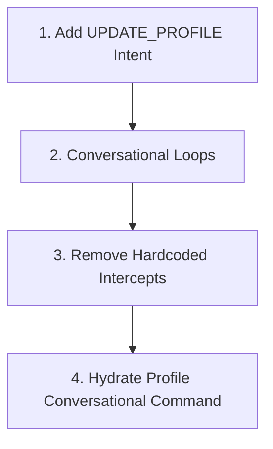

# MECE Audit: CareerLoop Conversational Intelligence & Chat Experience

This audit diagnoses the systemic limitations that prevent CareerLoop from feeling like a true, context-aware conversational agent—specifically focusing on why instructions like *"go find me on LinkedIn"* result in repetitive, hardcoded robotic slop.

---

## 1. The MECE Breakdown: The Three Layers of Chat Slop

To understand why the chat fails, we analyze the conversational pipeline across three mutually exclusive, collectively exhaustive layers:

```
                  ┌──────────────────────────────────────────────┐
                  │          THE CONVERSATIONAL FUNNEL           │
                  └──────────────────────┬───────────────────────┘
                                         │
                 [Layer A]  State Machine Caging (Rigidity)
                                         │
                 [Layer B]  Prompt & Intent Dilution (Routing)
                                         │
                 [Layer C]  Hardcoded Interceptions (Slop Blocks)
```

---

### Layer A: State Machine Caging (Control Flow Rigidity)
The state machine restricts users from taking actions that don't match their current numerical or enum state.
*   **The Locked Cage:** Once a user is in a post-onboarding state (`PROFILE_COMPLETE`, `BRIEF_AVAILABLE`, `APPLIED`), the graph completely disables onboarding sub-graphs. If you ask to *"find me on LinkedIn"* to update your profile, the system is physically locked out of transitioning you back to `ONBOARDING_IDENTIFYING` unless you execute a manual `/reset` slash command.
*   **Uni-directional Lifecycle:** The graph assumes user lifecycles are linear:
    `IDLE → ONBOARDING → PROFILE_COMPLETE → BRIEF_AVAILABLE`. It lacks conversational loops that allow natural deviations or profile updates from the active chat state.
*   **Zero Dynamic Sub-graph Invocation:** Sub-graphs (like profile scraping or deep research) cannot be invoked dynamically in a flat state model without changing the global session state node.

---

### Layer B: Prompt & Intent Dilution (Semantic Classification)
The natural-language intent classifier (`ChatIntentAgent`) has a narrow vocabulary that misclassifies conversational commands.
*   **Broad Keyword Mapping:** The router only classifies into 5 broad buckets (`SHOW_PIPELINE`, `SCAN_JOBS`, `DEEP_RESEARCH`, `APPROVE`, `GENERAL_CHAT`). Because *"find me on LinkedIn"* contains *"find"*, the LLM maps it to `SCAN_JOBS` (opportunity discovery).
*   **No "Profile Update" or "LinkedIn Fetch" Intent:** There is no dedicated intent for updating, syncing, or re-running profile onboarding details.
*   **History context is ignored in routing branches:** While `ChatIntentAgent` was recently modified to receive history in its `process()` signature, the command dispatcher and active state nodes do not leverage history to resolve user intent dynamically across state transitions.

---

### Layer C: Hardcoded Interceptions (The "Slop" Blockers)
Even if the LLM correctly parses intent or generates an intelligent reply, rigid code overrides block the output.
*   **The Brief-Ready Choke:** In `supervisor_graph.py`'s `_handle_active_state`, when an intent is classified as `SCAN_JOBS`, the code instantly runs a check:
    ```python
    if os.path.exists(brief_path):
        reply = "Today's brief is already ready! Type /brief to see it..."
    ```
    This completely overwrites whatever reply the LLM generated! The LLM might have said: *"I see you want to find your profile on LinkedIn, let me update that..."*, but the hardcoded check intercepted the `SCAN_JOBS` classification and threw the generic robot slop back to the user.
*   **Slash Command Bypass:** Slash commands are treated as pure strings in the CLI, completely bypassing the graph's LLM context entirely.

---

## 2. What CareerLoop Does Right (The Foundation)

*   **Idempotency & Caching:** The Daily Brief and MECE Company Intelligence caching mechanisms are highly optimized.
*   **Structured Pipeline Ledger:** The application tracking states and ledgers work reliably.
*   **History Reduction:** LangGraph's `add_messages` reducer successfully stores history.

---

## 3. Collectively Exhaustive Action Plan: Making CareerLoop Truly Conversational

To transform CareerLoop from a state-caged robot into an fluid career execution co-pilot, we must implement four structural changes:



### Action 1: Add a Dedicated `UPDATE_PROFILE` Intent
*   **Change:** Expand `ChatIntentAgent`'s system prompt to recognize when a user wants to search, update, scrape, or fetch their profile details from LinkedIn or a resume.
*   **Intent Token:** `UPDATE_PROFILE`.
*   **Result:** Prevent shoehorning profile requests into `SCAN_JOBS` discovery.

### Action 2: Enable Conversational Loops (Transition back to Onboarding)
*   **Change:** When the user is in `PROFILE_COMPLETE` or `BRIEF_AVAILABLE` and triggers the `UPDATE_PROFILE` intent, the graph will transition them back to the `ONBOARDING_IDENTIFYING` state.
*   **Result:** Saying *"update my LinkedIn"* or *"find me on LinkedIn"* immediately puts them in the interactive search loop without needing a manual `/reset`.

### Action 3: Remove Hardcoded Chokepoint Overwrites
*   **Change:** In `_handle_active_state`, do not blindly replace the LLM's response if a brief exists today. Instead, allow the LLM to explain that a brief exists or suggest running a fresh search conversational-style.
*   **Result:** Robotic repetition is replaced by context-aware conversation.

### Action 4: Real-Time LinkedIn Sync Action
*   **Change:** Integrate a command handler that parses name searches directly from chat, triggers the `LinkedInScraper` on the fly, and updates `config/profile.yml` and the SQLite database.
