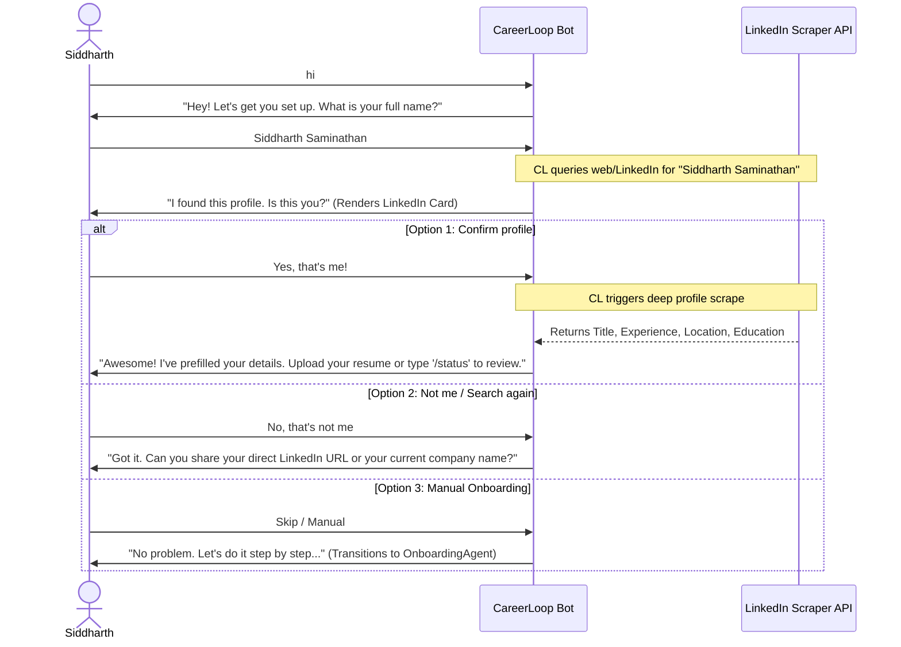

# Tal Inspiration — Interactive Chat Onboarding & Tinder-Swipe Jobs

This document outlines the product vision, user experience (UX) inspiration, and key interaction models drawn from the **Tal** app, adapted for the **CareerLoop** ecosystem.

---

## 1. The UX Philosophy: High-Frequency Momentum

Most career tools fail because they feel like work. They require filling out long, tedious profile forms, uploading resumes into black-box systems, and managing complex kanban boards. 

**Tal** flips this paradigm by making the job search feel conversational, responsive, and game-like:
*   **Onboarding is a conversation, not a form:** The user is greeted by a simple chat. The system does the heavy lifting of searching, verifying, and pulling data in real-time.
*   **Micro-interactions over data entry:** Asking "Is this you?" with a rich preview card creates an immediate "wow" factor and establishes instant trust.
*   **Tinder-like swiping for jobs:** Transforming job matching into a high-speed swipe flow removes decision fatigue and makes curation addictive.

---

## 2. Interactive Chat Onboarding Journey

The CareerLoop onboarding experience will be restructured into a structured, low-friction conversational funnel:



### Onboarding Steps & States

1.  **Step 1: The Hook (Identity Search)**
    *   **Prompt:** `"Hi! Let's get you set up in less than a minute. What is your full name?"`
    *   **Action:** System takes name input, performs a SerpAPI/LinkedIn search, and retrieves top 3 matching profiles (prioritized by country = India).
2.  **Step 2: Rich Card Confirmation**
    *   **Prompt:** `"I found a few profiles matching your name. Is this you?"`
    *   **UI Presentation:** Displays a rich card with the person's photo/logo, headline, current company, and location.
    *   **Buttons:** `[Yes, that's me!]`, `[No, search again]`, `[Enter profile URL manually]`.
3.  **Step 3: Auto-Hydration & Profile Extraction**
    *   **Action:** If confirmed, system scrapes the LinkedIn profile (using a headless scraper or a service like Proxycurl).
    *   **Mapping:** Parses experience to infer `target_roles` and `target_cities`. Extends `config/profile.yml` and `modes/_profile.md` automatically.
4.  **Step 4: Resume Capture**
    *   **Prompt:** `"Brilliant! I've prefilled your experience. Now, upload your latest resume/CV so I can extract your core technical proof points."`
5.  **Step 5: Completion & Verification**
    *   **Action:** Re-runs the `OnboardingAgent` to fill in the remaining fields (`salary_expectations`, `notice_period`, `aggressiveness`).
    *   **Confirmation:** Displays the fully hydrated profile card with `/status` command instructions.

---

## 3. The Tinder-Swipe Job Presentation Layer

Once onboarding is complete, the daily opportunity queue is presented as an interactive, highly visual list of cards designed for quick curation.

### Visual Design & Elements
*   **Company Logos:** Every job card displays the verified logo of the hiring company (fetched dynamically via a Logo API or scraped from LinkedIn/Favicon databases).
*   **Visual Status Indicators:** Highlights fit scores clearly (`69.3/100` -> Harmonized color: Emerald Green for >80, Amber for 60-80, Red for <60).
*   **Tinder Swiping (Swipe-to-Curation):**
    *   **Swipe Right (Shortlist / Approve):** Move opportunity to `SHORTLISTED` state and queue it for Application Pack Generation.
    *   **Swipe Left (Skip):** Move opportunity to `SKIP` or `DISCARDED` state.
    *   **Swipe Up (Deep-Inspect):** Trigger real-time, deep company intelligence report.

### The Job Detail Card Actions
When a user expands or clicks on an active job card, the system presents three primary actions:

1.  **🔗 Job Link (Always Verified)**
    *   **Requirement:** The link must be validated in real-time by a background `check-liveness` task using Playwright.
    *   **Experience:** Prevents displaying dead Greenhouse/Lever boards. Clicking the link takes the user directly to the active application form.
2.  **💬 Outreach Pack**
    *   **Content:** Personalized cold outreach message tailored to the role and the user's superpowers.
    *   **The Contact Layer:** Displays the target recruiter's name, designation, and direct LinkedIn profile URL.
    *   **The Click Flow:** The user clicks the recruiter's name to open their profile in a new tab, copies the generated outreach message, and sends it directly.
3.  **🧠 Dynamic Deep-Inspect**
    *   **Action:** Instead of waiting for a sequential daily brief or a multi-stage compilation, the user can ask direct questions about the company's funding status, recent news, business model, and tech stack.
    *   **Interaction:** Handled by a dedicated `DEEP_RESEARCH` chatbot node that queries the MECE Company Intelligence system on the fly.

---

## 4. UI Mockup (Adaptive Mobile Web / Telegram UX)

```
+-------------------------------------------------+
|               📊 CareerLoop Daily               |
+-------------------------------------------------+
|                                                 |
|  [  CheQ Logo  ]                                |
|  Applied AI Engineer                            |
|  CheQ (Fintech, Bengaluru)                      |
|                                                 |
|  🎯 Fit Score: 78/100 (Strong Role Fit)         |
|  💰 Budget: 22 - 25 LPA (Matches Target)        |
|                                                 |
|  "Hiring for a core member to build LLM-based  |
|   financial advisory agents..."                 |
|                                                 |
+-------------------------------------------------+
|  [ ❌ Skip ]     [ 🧠 Inspect ]    [  Approve ] |
+-------------------------------------------------+
|  Quick Actions:                                 |
|  - [🔗 View Job Link]                           |
|  - [💬 Outreach Recruiter (Aayush - HR Lead)]   |
+-------------------------------------------------+
```
