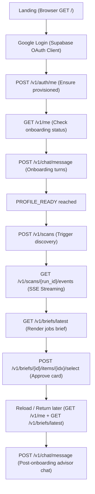

# CareerLoop REST API: MVP Endpoint Journey Map

This document maps the exact sequence of endpoints hit by the CareerLoop frontend browser client across the entire end-to-end user lifecycle.



---

## 1. Landing Phase
* **Endpoint:** Client-side HTML/React loading. No API endpoints hit.

---

## 2. Google Login Phase
* **Endpoint:** Handled entirely by the client-side Supabase SDK (`supabase.auth.signInWithOAuth`). Supabase returns a JSON Web Token (JWT).
* **JWT storage:** Saved locally as `sb-<project-id>-auth-token`.

---

## 3. Auth Me Phase (Bootstrap)
* **Endpoint:** `POST /v1/auth/me`
* **Request Header:** `Authorization: Bearer <JWT_TOKEN>`
* **Response:**
  ```json
  {
    "ok": true,
    "data": {
      "id": "56c02e37-0256-4b99-9944-56db98ad539f",
      "email": "user@example.com",
      "full_name": "Priya Sharma",
      "onboarding_complete": false
    },
    "error": null
  }
  ```

---

## 4. Protected Route & Onboarding State Check
* **Endpoint:** `GET /v1/me`
* **Purpose:** Inspects `onboarding_complete` to determine whether to render the Chat Onboarding view or mount the Main Dashboard.
* **Response:**
  ```json
  {
    "ok": true,
    "data": {
      "id": "56c02e37-0256-4b99-9944-56db98ad539f",
      "onboarding_complete": false
    }
  }
  ```

---

## 5. Onboarding Phase (Turn-by-Turn Conversational Chat)
* **Endpoint:** `POST /v1/chat/message`
* **Payload:** `{"text": "<User input string>"}`
* **Turn Sequence:**
  1. `text: "hello"` $\rightarrow$ Returns welcome prompt, transitions database session step to `10` (`STEP_IDENTIFYING`).
  2. `text: "Priya Sharma"` $\rightarrow$ Triggers LinkedIn lookup, resolves candidate card, transitions step to `11` (`STEP_PROFILE_CONFIRMATION`).
  3. `text: "YES"` $\rightarrow$ Hydrates profile from LinkedIn details, transitions step to `1` (`STEP_WAITING_CV`).
  4. `text: "<CV text>"` $\rightarrow$ Parses resume details, extracts fields, returns confirmation card, transitions step to `2` (`STEP_CONFIRMING`).
  5. `text: "yes"` $\rightarrow$ Completes onboarding OR transitions step to `3` (`STEP_COLLECTING`) to gap-fill missing fields.
  6. `text: "<gap fill answer>"` $\rightarrow$ Commits full profile to DB, seeds welcome brief, transitions session state and DB user state to `PROFILE_READY` (step `0`).

---

## 6. Profile Ready Transition
* **Endpoint:** Determined by the final turn response:
  ```json
  {
    "ok": true,
    "data": {
      "message": "Your profile is complete! Welcome...",
      "state": "PROFILE_READY"
    }
  }
  ```

---

## 7. Scanning Phase (Job Discovery)
* **Endpoint:** `POST /v1/scans`
* **Payload (Optional):** `{"mode": "scan_more"}` (forces fresh web portal searches)
* **Response:**
  ```json
  {
    "ok": true,
    "data": {
      "run_id": "run_9c512f87-1f5b-5e58-bf23-778d97e6e0a7",
      "status": "RUNNING",
      "mode": "default"
    }
  }
  ```

---

## 8. SSE Streaming Phase (Live Progress)
* **Endpoint:** `GET /v1/scans/{run_id}/events`
* **Protocol:** Server-Sent Events (SSE)
* **Client Implementation:**
  ```javascript
  const es = new EventSource(`/v1/scans/${runId}/events`);
  es.onmessage = (e) => {
    const data = JSON.parse(e.data);
    if (data.event_type === 'DONE') {
      es.close();
      loadLatestBrief();
    }
  };
  ```

---

## 9. Render Daily Brief Phase
* **Endpoint:** `GET /v1/briefs/latest?offset=0`
* **Response:** Contains the consolidated brief summary and matched jobs list:
  ```json
  {
    "ok": true,
    "data": {
      "id": "brief_12345",
      "date": "2026-05-30",
      "summary": "We found 3 high-fit ML opportunities in Bangalore...",
      "items": [
        {
          "index": 0,
          "score": 85,
          "fit_reasons": ["Matches NLP requirements", "Bangalore location"],
          "job": {
            "id": "job_9988",
            "title": "Senior ML Engineer",
            "company": "Razorpay",
            "location": "Bangalore"
          }
        }
      ]
    }
  }
  ```

---

## 10. Approve Opportunity Phase
* **Endpoint:** `POST /v1/briefs/{brief_id}/items/{item_index}/select`
* **Response:**
  ```json
  {
    "ok": true,
    "data": {
      "status": "approved",
      "job_id": "job_9988"
    }
  }
  ```

---

## 11. Reload & Return Later Phase
On app reload, the client calls:
1. `GET /v1/me` $\rightarrow$ Confirms `onboarding_complete = true` (directly mounts dashboard).
2. `GET /v1/briefs/latest` $\rightarrow$ Renders the active matching brief and preserves swipe status (previously approved job cards are visually greyed out/marked as Approved).

---

## 12. Post-Onboarding Chat Phase
* **Endpoint:** `POST /v1/chat/message`
* **Purpose:** Allows conversational interaction with the AI career advisor (e.g. asking for jobs, interview prep, recruiter reach out).
* **Router Routing:** ChatService detects `state == PROFILE_READY` and automatically routes the text to the LangGraph supervisor rather than the onboarding flow.
