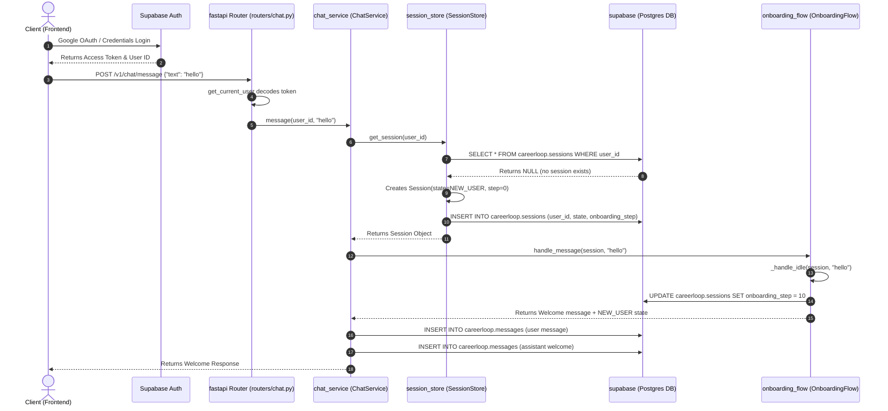

# NEW USER LIFECYCLE FORENSIC TRACE

This document traces the complete lifecycle of a new user's session from signup and authentication ingress to onboarding routing, showing every state change, line number, and database write.

---

## 1. End-to-End Sequence Diagram

---

## 2. In-Depth Transition Trace

### Step 1: User Signup & Identity Provision
* **Trigger:** Google OAuth completes.
* **File:** `careerloop_api/routers/auth.py`
* **Action:** Resolves OAuth credentials, creates auth record in `auth.users` (Supabase), and copies canonical profile spine to `careerloop.users` table:
  - **SQL Executed:** `supabase_migration_v3.sql#L66-L69`
  - **Old Value:** `N/A` (No record)
  - **New Value:** `careerloop.users` row with `id = '730d5bab-2587-4507-a16a-70cd662d59c2'`, `email = 'siddharth.swami99@gmail.com'`, `onboarding_status = 'new'`.
  - **Reason:** Canonical spine initialization for all authenticated accounts.

### Step 2: First Session Hydration (Bootstrapping)
* **Trigger:** User makes their first HTTP call to `POST /v1/chat/message`.
* **File:** `careerloop/session/session_store.py`
* **Function:** `get_session` (lines 162-202)
* **Action:** Since no session row exists in `careerloop.sessions`, initializes a default NEW_USER session:
  - **Old Value:** `N/A` (No row)
  - **New Value:** `careerloop.sessions` row with `user_id = '730d5bab-2587-4507-a16a-70cd662d59c2'`, `state = 'NEW_USER'`, `onboarding_step = 0`.
  - **Reason:** Creates the persistent journey tracking container.

### Step 3: First Turn - Greet to Identify Transition
* **Trigger:** User sends greeting `"hello"`.
* **File:** `careerloop/onboarding/onboarding_flow.py`
* **Function:** `_handle_idle` (lines 95-104)
* **Action:** Recognizes greeting, advances state step to 10 (`STEP_IDENTIFYING`):
  - **Old Value:** `session.onboarding_step = 0` (`STEP_IDLE`)
  - **New Value:** `session.onboarding_step = 10` (`STEP_IDENTIFYING`)
  - **Reason:** Prepares state machine to receive the user's name for SerpAPI lookup.
  - **Database Write:** Updates `careerloop.sessions` via `self._save(session)`.

### Step 4: The Lookup Failure Transition
* **Trigger:** User sends next input `"hello"`.
* **File:** `careerloop/onboarding/onboarding_flow.py`
* **Function:** `_handle_identifying` (lines 208-218)
* **Action:** SerpAPI LinkedIn search fails (interpreting `"hello"` as a full name). Falls back gracefully to manual CV upload path:
  - **Old Value:** `session.onboarding_step = 10` (`STEP_IDENTIFYING`)
  - **New Value:** `session.onboarding_step = 1` (`STEP_WAITING_CV`)
  - **Reason:** Gracefully transitions user to manual CV collection since automated LinkedIn parsing failed.
  - **Database Write:** Updates `careerloop.sessions` via `self._save(session)` to write `onboarding_step = 1`.
