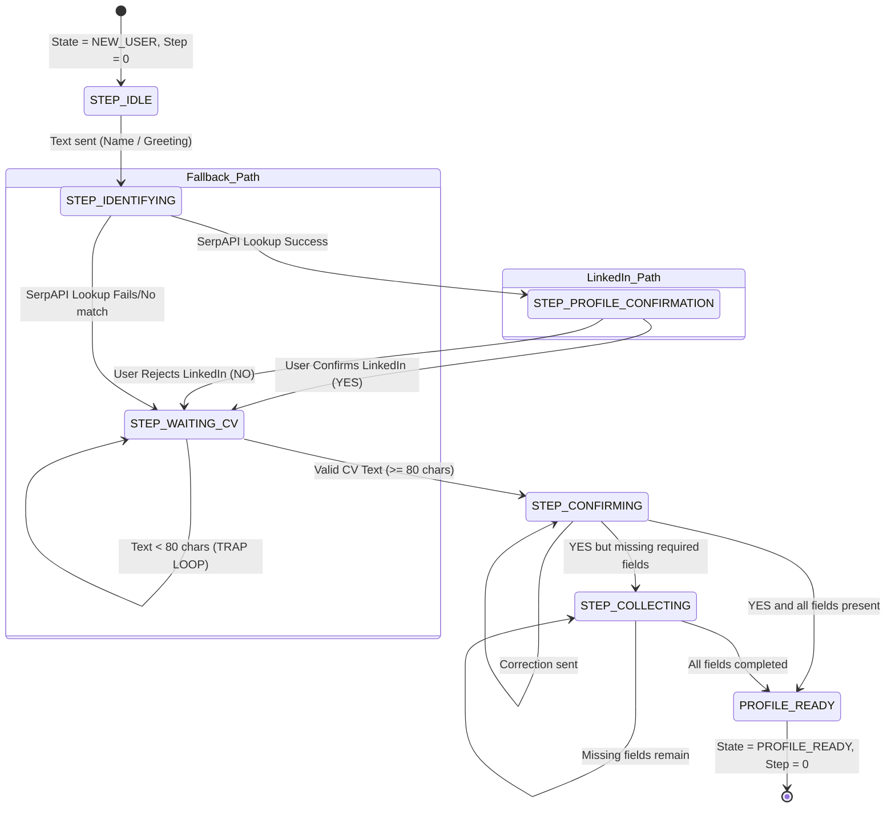

# CareerLoop Onboarding State Machine Reference

This document maps out the onboarding state machine within CareerLoop, covering state definitions, entry/exit guards, database updates, transitions, and the exact source code coordinates in `careerloop/onboarding/onboarding_flow.py`.

---

## State Machine Overview

The state machine manages the journey of a user from initial registration (`UserJourneyState.NEW_USER`) to profile completion (`UserJourneyState.PROFILE_READY`). It runs in two distinct paths:
1. **LinkedIn-First Path (Default):** Lookup user name → confirm profile → collect CV → confirm extraction → fill gaps → complete.
2. **Manual / CV-First Path (Fallback):** Skip LinkedIn/lookup fails → collect CV → confirm extraction → fill gaps → complete.

---

## Detailed State Mapping

### 1. START / `STEP_IDLE`
* **Constant Value:** `STEP_IDLE = 0` (defined on line 18)
* **Code Coordinates:** `careerloop/onboarding/onboarding_flow.py#L85-L104` (`_handle_idle`)
* **Entry Condition:** Session instantiated with `state = UserJourneyState.NEW_USER` and `onboarding_step = 0`.
* **Exit Condition:** User sends any text.
* **Database Writes:** None (runs transition in memory and writes next state).
* **Transitions:**
  - If greeting detected (e.g. `"hello"`, `"hi"`): Sets `session.onboarding_step = STEP_IDENTIFYING` (10), calls `self._save(session)`, and prompts for full name.
  - If non-greeting name/phrase sent: Sets `session.onboarding_step = STEP_IDENTIFYING` (10), calls `self._save(session)`, and immediately forwards to `_handle_identifying` (runs SerpAPI lookup on the input string).
* **Next State:** `STEP_IDENTIFYING` (10).

---

### 2. NAME / LINKEDIN / `STEP_IDENTIFYING`
* **Constant Value:** `STEP_IDENTIFYING = 10` (defined on line 23)
* **Code Coordinates:** `careerloop/onboarding/onboarding_flow.py#L192-L247` (`_handle_identifying`)
* **Entry Condition:** `session.onboarding_step == STEP_IDENTIFYING`.
* **Exit Condition:** User sends a search candidate name.
* **Database Writes:** Sets `session.onboarding_step` and updates `session.temp_profile_data` via `self._save(session)`.
* **Transitions:**
  - If input `len(cleaned) >= 80` (user pasted their CV instead of a name): Sets `session.onboarding_step = STEP_WAITING_CV` (1), calls `self._save(session)`, and forwards directly to `_handle_waiting_cv`.
  - If SerpAPI LinkedIn lookup fails or is empty: Sets `session.onboarding_step = STEP_WAITING_CV` (1), calls `self._save(session)`, and prompts user to paste CV + LinkedIn URL manually.
  - If SerpAPI lookup finds a confident match: Stashes candidate in `session.temp_profile_data["_identity_candidate"]`, sets `session.onboarding_step = STEP_PROFILE_CONFIRMATION` (11), calls `self._save(session)`, and displays profile confirmation card.
* **Next State:** `STEP_WAITING_CV` (1) or `STEP_PROFILE_CONFIRMATION` (11).

---

### 3. IDENTITY / `STEP_PROFILE_CONFIRMATION`
* **Constant Value:** `STEP_PROFILE_CONFIRMATION = 11` (defined on line 24)
* **Code Coordinates:** `careerloop/onboarding/onboarding_flow.py#L248-L297` (`_handle_profile_confirmation`)
* **Entry Condition:** `session.onboarding_step == STEP_PROFILE_CONFIRMATION`.
* **Exit Condition:** User confirms or rejects the identified profile.
* **Database Writes:** Mutates `session.temp_profile_data` and sets `session.onboarding_step = STEP_WAITING_CV` (1).
* **Transitions:**
  - If user answers **YES** (affirmative): Hydrates available profile info (name, roles, cities, linkedin_url), sets `session.onboarding_step = STEP_WAITING_CV` (1), saves the session, and prompts user to paste their CV (or type `"skip"` to keep the LinkedIn profile only).
  - If user answers **NO** (negative): Discards stashed candidate, sets `session.onboarding_step = STEP_WAITING_CV` (1), saves the session, and redirects to manual CV upload path.
  - If user types **"skip"**: Only allowed if `cv_content` already exists with length >= 50 (checked in `_proceed_after_linkedin`), otherwise redirects to CV collection.
* **Next State:** `STEP_WAITING_CV` (1).

---

### 4. CV_UPLOAD / CV_EXTRACTION / `STEP_WAITING_CV`
* **Constant Value:** `STEP_WAITING_CV = 1` (defined on line 19)
* **Code Coordinates:** `careerloop/onboarding/onboarding_flow.py#L106-L141` (`_handle_waiting_cv`)
* **Entry Condition:** `session.onboarding_step == STEP_WAITING_CV`.
* **Exit Condition:** User pastes resume text or uploads a file.
* **Database Writes:** Updates `session.temp_profile_data` with extracted JSON fields and sets `session.onboarding_step = STEP_CONFIRMING` (2) via `self._save(session)`.
* **Transitions:**
  - If user input `len(text.strip()) < 80`: **TRAP LOOP TRIGGERED!** Stays in `STEP_WAITING_CV` (1), calls `self._save(session)`, and returns static error prompt: *"The message you sent is too short to be parsed as a full resume..."*. No state mutation occurs.
  - If user input `len(text.strip()) >= 80`: Calls `self.extraction_agent.extract(text)` (DeepSeek API call), updates `temp_profile_data`, sets `session.onboarding_step = STEP_CONFIRMING` (2), saves session, and prompts for confirmation of extracted fields.
* **Next State:** `STEP_WAITING_CV` (1) [on validation error] or `STEP_CONFIRMING` (2) [on successful extraction].

---

### 5. GAP_FILL / `STEP_CONFIRMING` & `STEP_COLLECTING`
* **Constant Values:** `STEP_CONFIRMING = 2`, `STEP_COLLECTING = 3` (defined on lines 20-21)
* **Code Coordinates:**
  - `_handle_confirming`: `careerloop/onboarding/onboarding_flow.py#L142-L172`
  - `_handle_collecting`: `careerloop/onboarding/onboarding_flow.py#L173-L189`
* **Entry Condition:** `session.onboarding_step == STEP_CONFIRMING` (after extraction) or `STEP_COLLECTING` (during gap fill).
* **Exit Condition:** User confirms details or answers conversational gap-fill questions.
* **Database Writes:** Updates `session.temp_profile_data`. On completion, performs transaction in `_commit_profile_to_db` and `_seed_welcome_brief` to write canonical tables.
* **Transitions (Confirming):**
  - If user answers **YES**:
    - If all `REQUIRED_FIELDS` (`target_roles`, `target_cities`, `salary_expectations`, `notice_period`, `current_ctc`) are present: Calls `_complete_onboarding` and transitions to `PROFILE_READY`.
    - If fields are missing: Sets `session.onboarding_step = STEP_COLLECTING` (3), saves, and prompts for missing fields.
  - If user answers with **corrections**: Processes correction using `OnboardingAgent.process()`. If complete and no missing fields, calls `_complete_onboarding`. Otherwise, re-saves in `STEP_CONFIRMING` (2).
* **Transitions (Collecting):**
  - Iteratively prompts for missing fields. Uses `OnboardingAgent.process()` to record answers in `session.temp_profile_data`.
  - Once all fields are gathered: Calls `_complete_onboarding` and transitions to `PROFILE_READY`.
* **Next State:** `STEP_CONFIRMING` (2), `STEP_COLLECTING` (3), or `UserJourneyState.PROFILE_READY`.

---

### 6. PROFILE_READY
* **Constant Value:** `UserJourneyState.PROFILE_READY` (imported from `careerloop.session.states`)
* **Code Coordinates:** `careerloop/onboarding/onboarding_flow.py#L335-L380` (`_complete_onboarding`)
* **Entry Condition:** Called internally from confirming/collecting when a valid CV is present and all required profile fields are stored.
* **Exit Condition:** Terminal onboarding state.
* **Database Writes (CRITICAL TRANSACTION):**
  - **`careerloop.users`**: Writes `master_cv_markdown` (original resume text), `work_style_prefs` (JSONB), and canonical columns: `target_roles`, `target_cities`, `salary_expectations`, `notice_period`, `linkedin_url`, `full_name`, and sets `onboarding_complete = TRUE`.
  - **`careerloop.daily_briefs`**: Inserts a default welcome daily brief to prevent first-load 404s.
  - **`careerloop.sessions`**: Sets `state = UserJourneyState.PROFILE_READY` and resets `onboarding_step = 0`.
* **Transitions:** Transitions session out of the onboarding engine. Subsequent chat messages are routed to the main LangGraph supervisor graph.
* **Next State:** None (onboarding complete).
