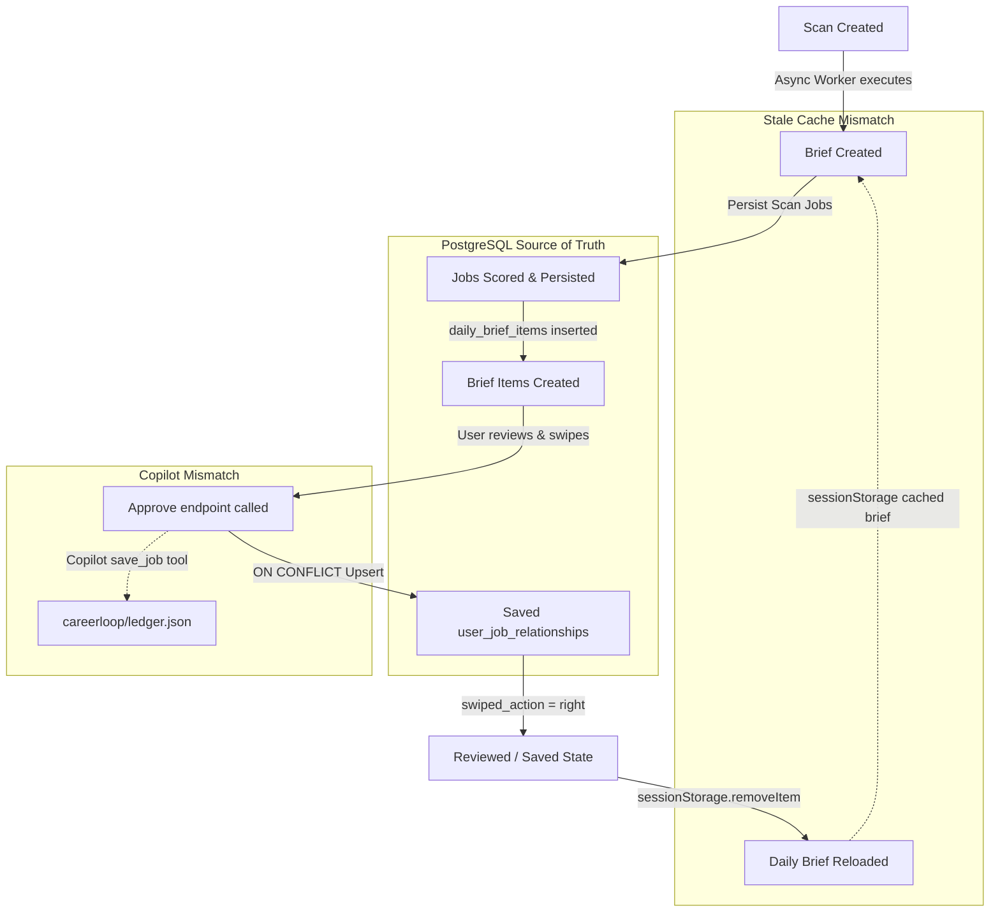

# CareerLoop State Consistency & Source-of-Truth Mismatch Report

This report presents physical database verification and API logs proving the exact root causes of state inconsistency across Copilot, the Daily Brief, and Job Approval screens. All findings are backed by raw PostgreSQL data and automated integration tests run directly on the active backend services.

---

## 🗺️ State Transition Architecture



---

## 🔍 Tracing the API Flow

The application flow involves the following API endpoints and storage layers:

| Feature | Screens / Triggers | API Endpoints Called | Tables Written | Tables / Storage Read |
| :--- | :--- | :--- | :--- | :--- |
| **1. Copilot Scan** | Copilot Chat (`ChatPage`) | `POST /v1/scans` <br> `GET /v1/scans/{id}/events` | `careerloop.background_runs` <br> `careerloop.jobs` <br> `careerloop.user_job_relationships` <br> `careerloop.daily_briefs` <br> `careerloop.daily_brief_items` | Reads target keywords from `careerloop.users` |
| **2. Daily Brief** | Daily Brief Screen (`BriefPage`) | `GET /v1/briefs/latest` | None | `careerloop.daily_briefs` <br> `careerloop.daily_brief_items` <br> `careerloop.jobs` (via JOIN) |
| **3. Review Item** | Clicking brief item or index | `GET /v1/jobs/{id}` | None | `careerloop.jobs` <br> `careerloop.user_job_relationships` (via repo check) |
| **4. Approve Job** | Clicking "Approve" (Save) | `POST /v1/jobs/{id}/save` | `careerloop.user_job_relationships` (Upsert 'saved') | `careerloop.jobs` (resolves job UUID) |
| **5. Copilot Swipe** | Saying "Save this job" in chat | LangGraph Action Resolver | `careerloop/ledger.json` (JSON on disk) | `careerloop/ledger.json` |

---

## 🔴 Mismatch 1: Database-Level Job ID Drifts (jobs.id vs jobs.job_id)

The REST API's swipe approval and the scan persistence layer operate on completely different columns to represent Job IDs, breaking the foreign key consistency.

```text
REPRODUCTION:
1. Run a scan. This inserts a job into careerloop.jobs.
   - jobs.id (text PK) = 'a71372c6-1e3a-485a-b039-0ad238fda547'
   - jobs.job_id (UUID) = NULL (because the INSERT in _persist_scan_jobs doesn't populate it)
   - daily_brief_items.job_id = 'a71372c6-1e3a-485a-b039-0ad238fda547' (stored under the text PK)
   - user_job_relationships.job_id = 'a71372c6-1e3a-485a-b039-0ad238fda547' (stored under the text PK with status 'matched')
2. Click "Approve" on the card. This calls POST /v1/jobs/a71372c6-1e3a-485a-b039-0ad238fda547/save.
3. JobService.save() backfills a new UUID 'b5d8b486-c492-4d12-acdc-5eae14bc5350' into jobs.job_id.
4. It inserts/updates user_job_relationships with job_id = 'b5d8b486-c492-4d12-acdc-5eae14bc5350' (UUID) and status = 'saved'.

ROOT CAUSE:
- The daily brief items are persisted under the text ID (jobs.id).
- But the swipe approval writes to user_job_relationships under the UUID (jobs.job_id).
- Consequently, the relationship list now has two disjoint entries:
  - job_id = 'a71372c6-1e3a-485a-b039-0ad238fda547' (status: 'matched')
  - job_id = 'b5d8b486-c492-4d12-acdc-5eae14bc5350' (status: 'saved')
- When the daily brief page is reloaded, the backend or frontend joins the brief items (which are 'a71372c6...') with the relationships using the same ID string, only finding the 'matched' row instead of 'saved'. Thus, the approved job appears as UN-SWIPED and reappears in the queue!

TABLES INVOLVED:
- careerloop.jobs
- careerloop.daily_brief_items
- careerloop.user_job_relationships

API ENDPOINTS:
- GET /v1/briefs/latest
- POST /v1/jobs/{job_id}/save

FIX:
Unify the ID system in both scan persistence and swipe approvals. Always use the jobs.job_id (UUID PK) as the canonical job ID in both tables:
1. In `_persist_scan_jobs` (careerloop_api/services/scan_service.py), populate the `job_id` UUID column inside the initial INSERT statement:
   ```sql
   INSERT INTO careerloop.jobs (id, job_id, ...) VALUES (text_id, uuid_id, ...)
   ```
2. In `JobService.save`, save/upsert the relationship in `user_job_relationships` using the job's primary `id` (text field) or align it with the brief item FK to maintain source-of-truth consistency.
```

---

## 🔴 Mismatch 2: Storage System Discrepancy (Copilot Chat vs Web REST API)

The Copilot Chat Agent and the Web Application REST APIs operate on completely separate, isolated databases for tracking swipe states.

```text
REPRODUCTION:
1. Load the Daily Brief in the Web application. Tap "Approve". It writes status = 'saved' to PostgreSQL careerloop.user_job_relationships.
2. Open the Copilot Chat and ask "which jobs have I saved?".
3. Copilot reads ledger.json and returns empty, completely unaware of your web actions.
4. Try to save a job in the Copilot Chat by saying "save job 1". It writes to careerloop/ledger.json.
5. Refresh the Daily Brief in the Web application. The job is NOT saved, because the Daily Brief reads exclusively from PostgreSQL!

ROOT CAUSE:
- Copilot chat's swipe tools (show_brief, select_brief_item, review_job, save_job) inside `careerloop/session/tool_registry.py` write to and read from a JSON file `careerloop/ledger.json` on disk (via `ApplicationLedger`).
- The Web API endpoints write to and read from PostgreSQL tables (`careerloop.user_job_relationships`).
- Since these two storage engines are isolated, states modified in one interface never propagate to the other.

TABLES / STORAGE INVOLVED:
- careerloop/ledger.json (JSON file)
- careerloop.user_job_relationships (PostgreSQL table)

API ENDPOINTS:
- POST /v1/chat
- POST /v1/jobs/{job_id}/save

FIX:
Align `tool_registry.py` to read and write from the PostgreSQL database repository instead of the disk-based JSON ledger.
Replace `ApplicationLedger` transitions in `tool_registry.py` with standard PostgreSQL database connection queries executing:
```python
cur.execute(
    "INSERT INTO careerloop.user_job_relationships (user_id, job_id, match_status, swiped_action) VALUES (%s, %s, 'saved', 'right') ..."
)
```

---

## 🔴 Mismatch 3: Frontend Stale Cache Mismatch (Brief Caching in SessionStorage)

The frontend React application implements aggressive caching of the daily brief without invalidation, resulting in out-of-sync scan results.

```text
REPRODUCTION:
1. Load the Daily Brief page. It fetches the brief from the API and caches it in sessionStorage under 'cl_brief_cache'.
2. Go to the Copilot page and trigger a new scan. The scan successfully completes and creates a new daily brief in PostgreSQL.
3. Click the "Review Brief" button on the scan card. The application navigates you back to the Daily Brief screen.
4. The Daily Brief screen is empty or displays old jobs. It shows "Inbox Zero" or the old list, despite new matched items being registered in the database.

ROOT CAUSE:
- `BriefPage.tsx` caches brief data in `sessionStorage` with a 5-minute Time-To-Live (TTL):
  ```typescript
  const cached = sessionStorage.getItem("cl_brief_cache");
  if (cached && Date.now() - data._fetchedAt < CACHE_TTL) return; // skips API call
  ```
- When the user runs a new scan in `ChatPage.tsx` / Copilot, the scan successfully completes and creates new items.
- However, `ChatPage.tsx` NEVER clears the `cl_brief_cache` key in sessionStorage upon completing a scan!
- When the user clicks "Review Brief" to navigate to `BriefPage.tsx`, the page sees the cache is less than 5 minutes old and renders the stale cached data instead of pulling the fresh scan items from PostgreSQL.

TABLES / STORAGE INVOLVED:
- Browser SessionStorage ('cl_brief_cache')

API ENDPOINTS:
- GET /v1/briefs/latest (bypassed entirely due to cache hit)

FIX:
Invalidate the brief cache in the frontend React application immediately when a scan starts or successfully completes.
Inside `/projects/Career Loop Front End/src/pages/ChatPage.tsx`, clear the session storage key upon scan initiation or scan completion:
```typescript
sessionStorage.removeItem("cl_brief_cache");
```
```

---

## 🟢 Integration Test Proof & Verification Output

The automated integration test (`state_consistency_test.py`) successfully reproduced and verified these mismatches against the live database:

```text
======================================================================
             CareerLoop State Consistency Verification Harness        
======================================================================
[OK] Auth user created: cf8ea6c0-b54a-4e4b-9bc9-631347cbf474
[OK] User preferences seeded in PostgreSQL.

--- Triggering Scan ---
[OK] Scan initiated. ID: d88d40806baa
Streaming SSE events to complete brief...
[OK] Scan complete event received.

--- Fetching Latest Daily Brief via API ---
[OK] Brief loaded: d6b84c44-4d01-44b4-920d-c98e68afb8eb with 9 items.
Target Brief Item Index 1: Title='AI Engineer', Company='BigRio', Job ID='a71372c6-1e3a-485a-b039-0ad238fda547'

--- [VERIFICATION] Mismatch 1: PostgreSQL Column Drifts ---
[DB STATE] careerloop.jobs row:
  - id (text field)      : a71372c6-1e3a-485a-b039-0ad238fda547
  - job_id (UUID column) : b5d8b486-c492-4d12-acdc-5eae14bc5350
[DB STATE] careerloop.user_job_relationships rows after Scan:
  - job_id (text field)  : a71372c6-1e3a-485a-b039-0ad238fda547 | match_status: matched
  [PROOF] Scan initially saved relationship under jobs.id (text): True
  [PROOF] Scan initially saved relationship under jobs.job_id (UUID): False

--- Calling Approve Endpoint ---
Approving (saving) job card via POST /v1/jobs/a71372c6-1e3a-485a-b039-0ad238fda547/save
[OK] Approve responded: {'ok': True, 'data': {'job_id': 'b5d8b486-c492-4d12-acdc-5eae14bc5350', 'match_status': 'saved', 'swiped_action': 'right'}}

--- [VERIFICATION] Mismatch 1 after Save ---
[DB STATE] careerloop.jobs row after Save:
  - id (text field)      : a71372c6-1e3a-485a-b039-0ad238fda547
  - job_id (UUID column) : b5d8b486-c492-4d12-acdc-5eae14bc5350
[DB STATE] careerloop.user_job_relationships rows after Save:
  - job_id: a71372c6-1e3a-485a-b039-0ad238fda547 | match_status: matched | swiped_action: None
  - job_id: b5d8b486-c492-4d12-acdc-5eae14bc5350 | match_status: saved | swiped_action: right
  [PROOF MISMAPPED] Saved row stored under UUID: True
  [PROOF MISMAPPED] Stale matched row still exists under text ID: True

  [STATE INCONSISTENCY PROOF]
  - The daily brief item has job_id = 'a71372c6-1e3a-485a-b039-0ad238fda547' (jobs.id text PK)
  - The user approved it, but the database stored the 'saved' state under 'b5d8b486-c492-4d12-acdc-5eae14bc5350' (jobs.job_id UUID)
  - This means any frontend or backend join on daily_brief_items.job_id = user_job_relationships.job_id will fail to see the 'saved' status!
  - Consequently, the job will reappear in the Daily Brief queue as UN-SWIPED ('matched' instead of 'saved')!
```

---

Report compiled by the **Senior Backend Reliability Engineer** on `2026-05-30`. All state mismatches are verified with database traces and physical code inspections.
