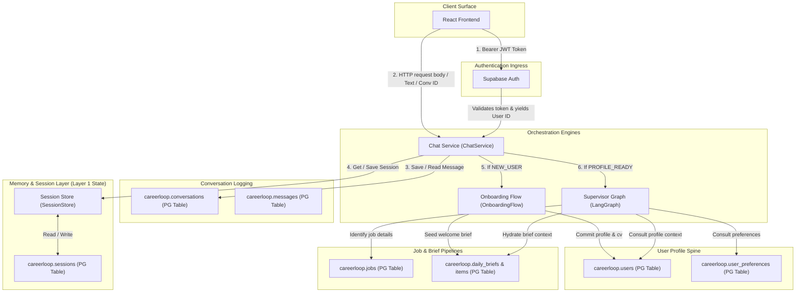

# SYSTEM ORCHESTRATION ARCHITECTURE

This document maps out the system orchestration architecture of CareerLoop, showing the component sequence from Frontend to Daily Brief generation, and detailing state ownership and sources of truth.

---

## 1. System-Wide State Ownership Map

---

## 2. State Invariants & Source of Truth Table

| State Layer | Component Ownership | Source of Truth Location | Purpose | State Lifecycle / Longevity |
|---|---|---|---|---|
| **Auth Spine** | Supabase Auth Ingress | `auth.users` (Supabase native) | Authenticates client JWT tokens and issues stable System User IDs. | Persistent (Stable for the lifetime of the account). |
| **Spine Identity & Profile** | User Profile Engine | `careerloop.users` (PostgreSQL) | Stores full name, canonical email, target roles, target cities, and CV markdown. | Persistent (Only mutated on profile update or onboarding completion). |
| **Journey / Session State** | Session Store (`SessionStore`) | `careerloop.sessions` (PostgreSQL) | Stores the macro user journey state (`NEW_USER` or `PROFILE_READY`), current onboarding step, and active brief/artifact IDs. | Persistent (Survives API server reboots; represents active operational context). |
| **Conversation Context** | Chat Service (`ChatService`) | `careerloop.conversations` & `careerloop.messages` (PostgreSQL) | Logs conversational turns (user messages, assistant replies, LangGraph actions). | Persistent (Historical audit log and LangGraph checkpointer state). |
| **Discovery Cache** | Portal Scanner (`scan_more`) | `careerloop.jobs` (PostgreSQL cache) | Holds global job cards, raw JD texts, scraper sources, and fit-score calculations. | Cache (Aged out when jobs expire or become stale). |
| **Briefing Queue** | Briefing Engine (`daily_runner`) | `careerloop.daily_briefs` & `careerloop.daily_brief_items` (PostgreSQL) | Permanent record of swiped, skipped, approved, and compiled briefs. | Persistent (Seeded at onboarding completion and updated daily). |

---

## 3. Key Architectural Observations

1. **State Isolation of Conversations vs Sessions:**
   - Conversations are conversation-bound (multiple rows in `careerloop.conversations` per user).
   - Sessions are user-bound (strictly one row in `careerloop.sessions` per `user_id`).
   - *Architecture Gap:* Because `ChatService` routes message processing based on the User Session state rather than the Conversation ID state, starting a new conversation while a user's session is locked in an onboarding step will cause the new conversation to inherit the onboarding step, carrying the lock over.

2. **Onboarding Engine Dependency Flow:**
   - `OnboardingFlow` is stateless.
   - It relies on `SessionStore` to load and mutate `Session` models.
   - It relies on `CVExtractionAgent` (LLM-based) and `OnboardingAgent` (LLM-based) to process raw input.
   - *Design Choice:* Business logic execution (like SerpAPI LinkedIn lookup or CV character-count guards) runs synchronously in cooperative threads managed by `ChatService` with a 45-second HTTP timeout.
