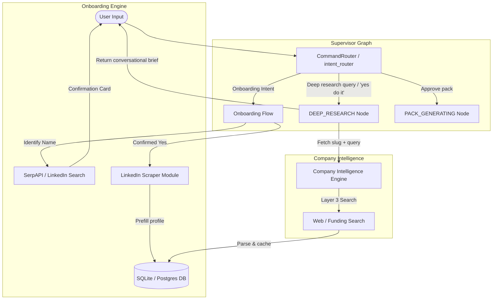

# Engineering Plan: Tal Onboarding & Dynamic Company Research

This document outlines the technical specification, database changes, and system architecture updates required to implement the conversational, LinkedIn-driven onboarding flow and dynamic deep company research routing in CareerLoop.

---

## 1. Architectural Changes Overview

To implement these features, we will upgrade CareerLoop's LangGraph session layer, the onboarding flow, and the company intelligence execution paths:



---

## 2. Part 1: Interactive Chat Onboarding Flow

We will introduce two new states and integrate a LinkedIn discovery & extraction module.

### A. New Onboarding States (`careerloop/session/states.py`)
```python
class UserState(str, Enum):
    IDLE = "IDLE"
    ONBOARDING_IDENTIFYING = "ONBOARDING_IDENTIFYING"          # Searching for LinkedIn profile
    ONBOARDING_PROFILE_CONFIRMATION = "ONBOARDING_PROFILE_CONFIRMATION"  # Asking "Is this you?"
    ONBOARDING_WAITING_CV = "ONBOARDING_WAITING_CV"
    ONBOARDING_COLLECTING = "ONBOARDING_COLLECTING"
    PROFILE_COMPLETE = "PROFILE_COMPLETE"
    ...
```

### B. LinkedIn Search & Scraper Module (`careerloop/sources/linkedin_scraper.py`)
We will create a helper module that interfaces with search APIs and scrapes profile details:

```python
class LinkedInScraper:
    def __init__(self, serp_api_key: str, scraper_api_key: str):
        self.serp_api_key = serp_api_key
        self.scraper_api_key = scraper_api_key

    def search_profile(self, name: str) -> list[dict]:
        """Search Google/SerpAPI for the person's LinkedIn profile in India."""
        # Query: site:linkedin.com/in/ "Name" India
        # Returns a list of matches with title, link, snippet, and thumbnail.
        pass

    def scrape_profile(self, profile_url: str) -> dict:
        """Call a robust API (e.g. Proxycurl, ScrapingBee) to retrieve rich profile JSON."""
        # Returns: { full_name, headline, location, summary, experience: [...], education: [...] }
        pass
    
    def map_to_profile_data(self, profile_json: dict) -> dict:
        """Translate raw scraped JSON into CareerLoop's work_style_prefs format."""
        # Inferred roles from current/past titles
        # Inferred target cities from profile location
        pass
```

### C. Conversational Logic (`careerloop/onboarding/onboarding_flow.py`)
Update `OnboardingFlow.handle_message()` to drive the state transitions:
1.  **State IDLE -> ONBOARDING_IDENTIFYING:** Greets user and asks for full name.
2.  **State ONBOARDING_IDENTIFYING -> ONBOARDING_PROFILE_CONFIRMATION:** Performs search, displays top match profile card with photo/logo and headline.
3.  **State ONBOARDING_PROFILE_CONFIRMATION -> ONBOARDING_WAITING_CV:** 
    *   If "Yes": Scrapes profile, pre-fills profile database tables, and prompts for CV/Resume upload.
    *   If "No": Asks for direct LinkedIn profile link or company name to refine search.
4.  **State ONBOARDING_WAITING_CV -> ONBOARDING_COLLECTING:** Accepts CV upload, runs Resume Council extraction, and completes onboarding fields.

---

## 3. Part 2: Dynamic Chatbot Routing for Deep Company Research

In the transcript, the chatbot gets stuck after asking "Would you like me to scan for more specific information...?" because:
1.  The intent classifier lacks multi-turn conversation history.
2.  There is no `DEEP_RESEARCH` execution node in the supervisor graph.

We will fix this with three major upgrades:

### A. Add Multi-Turn History to ChatIntentAgent (`careerloop/llm_chat.py`)
Modify `ChatIntentAgent` to accept `messages` history (as a list of base messages) instead of a single string, providing critical context to resolve pronouns and confirmations:

```python
class ChatIntentAgent(LLMChatAgent):
    SYSTEM_PROMPT = """You are the CareerLoop central router.
Analyze the user's message history and their profile context.
Determine the user's intent:
- SHOW_PIPELINE: User wants to see jobs, briefings, or curations.
- SCAN_JOBS: User explicitly wants to run a new discovery crawl.
- DEEP_RESEARCH: User wants specific details, funding, stack info, or has accepted a proposal to fetch intelligence about a company or job.
- APPROVE: User is confirming or saying yes to proceed (e.g., generating a package, submitting an app).
- GENERAL_CHAT: Conversational queries or generic chat.

Return ONLY valid JSON:
{
  "intent": "DEEP_RESEARCH",
  "reply": "Brief confirmation to the user.",
  "company_slug": "cheq",
  "specific_question": "Are they funded? What is their recent funding round?"
}"""

    def process(self, messages: list, profile_data: dict) -> dict:
        # 1. Format the last 4-5 messages into a chat transcript for the LLM
        # 2. Inject user profile
        # 3. Call API and parse returned JSON (including intent, reply, company_slug, and specific_question)
        pass
```

### B. New Graph Node: `deep_research_node` (`careerloop/session/supervisor_graph.py`)
Add a new node and routing edge to handle deep intelligence requests in real-time:

```python
# In ConversationState schema:
class ConversationState(TypedDict):
    ...
    pending_research_company: Optional[str]
    specific_question: Optional[str]

# 1. The Research Node
def deep_research_node(state: ConversationState) -> dict:
    company = state.get("pending_research_company") or "unknown"
    question = state.get("specific_question") or "Tell me about this company."
    
    # Trigger MECE Company Intelligence Engine
    from careerloop.company_intel import CompanyIntelligenceEngine
    engine = CompanyIntelligenceEngine()
    
    # Layer 1 + 2 + 3 fetch (with web search enabled specifically for the query)
    intel = engine.get_intelligence(company, enable_web_search=True)
    
    # Run a lightweight LLM Synthesis to answer the user's specific question
    # based on the scraped structured intelligence
    answer = engine.synthesize_answer(intel, question)
    
    return {
        "current_state": UserState.PROFILE_COMPLETE, # Transition back to active state
        "assistant_response": answer,
        "messages": [AIMessage(content=answer)],
        "pending_research_company": None,
        "specific_question": None,
    }

# 2. Update Graph Build & Conditional Edges
def route_from_intent(state: ConversationState):
    curr = normalize_user_state(state.get("current_state", UserState.IDLE))
    if curr == UserState.PACK_GENERATING:
        return "pack_generation"
    elif curr == UserState.RESEARCHING_COMPANY:
        return "deep_research"
    return END
```

---

## 4. Part 3: Verified Links & Outreach Guards

To prevent link hallucination and improve cold outreach delivery:

### A. Discovery Link Validation
During the discovery crawl (`careerloop/discovery.py`), every discovered opportunity URL must be run through a validation queue:
```python
def verify_opportunity_link(url: str) -> bool:
    """Verifies that the job URL actually points to a live application form.
    Calls check-liveness.mjs via check_liveness_tool.
    """
    from careerloop.session.supervisor_graph import check_liveness_tool
    res = check_liveness_tool(url)
    # Parse output: if expired signal wins or page is blank/empty, return False
    return "expired" not in res.lower() and "inactive" not in res.lower()
```

### B. Recruiter Outreach Matching
During MECE Layer 3 company intelligence search, the system will query:
`"{company_name} hiring team" OR "{company_name} recruiter" site:linkedin.com/in/`
to fetch top matching recruiter profiles:
*   Extract name, title, and profile link.
*   Validate using the scraper or check for profile liveness.
*   Populate `recruiter_info` within the synthesized report, ensuring the outreach pack contains direct, validated, clickable links:
    *   Example: `[Aayush Sharma (Talent Acquisition Lead)](https://www.linkedin.com/in/aayush-sharma-recruiter-link)`

---

## 5. UI Presentation Layers (Future Roadmap Actions)

While the backend logic executes robustly, we will log the necessary UI parameters so the future Telegram, Web, or iOS client can render premium elements:
1.  **`company_logo_url`:** Scraped from Clearbit, Logo.dev, or favicon scraping, and saved to `users.temp_profile_data` or the application pack.
2.  **Tinder Swiping Payload:** The daily brief command (`/brief`) will output structured JSON containing the curated list of jobs (id, title, company, logo, score, description, links) so the frontend client can render tinder-swipe cards natively.
