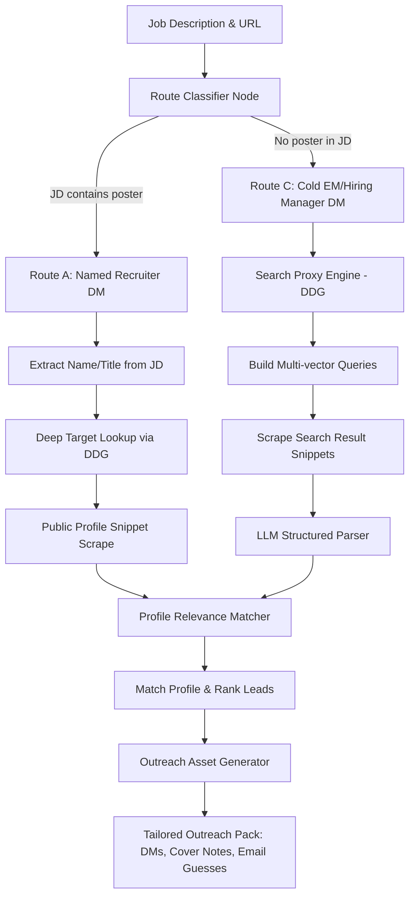

# Recruiter Outreach & Matching Engine — Implementation Plan

**Date:** May 23, 2026  
**Status:** Under Review  
**Target:** Phase 1 Application Action Engine (The Paid Wedge)  

---

## 1. Executive Summary & Goal

The core philosophy of CareerLoop is that **Discovery is top-of-funnel (free), while Execution & Momentum are the paid product**. Low conversion rates in job applications stem from "blind ATS submissions" where resumes are sprayed into the void. To fix this, CareerLoop must act as a **Route Classification & Lead Generation Engine** that guides users through high-converting, human-centric application loops:

*   **Route A: Named Recruiter DM** (Highest conversion) — Direct contact with the person who posted the job.
*   **Route B: Referral Ask** — Finding an internal contact or alumni at the company.
*   **Route C: Cold Hiring Manager DM** — Targeted outreach to the Head of X or VP of Y managing the team.
*   **Route D: Blind ATS Submit** — Standard submission (fallback only when no humans are found).

This plan outlines the architecture to build an automated Recruiter & People Scraper that maps these routes, fetches profiles via a DuckDuckGo Search Proxy, ranks them using LLM structured extraction, and generates tailored outreach packs.

---

## 2. High-Level Architecture & Flow



---

## 3. MECE Phase Breakdown

To build this system from first principles without getting blocked by LinkedIn's login walls, we partition the engineering tasks into five Mutually Exclusive, Collectively Exhaustive (MECE) phases:

### Phase 1: JD Explicit Recruiter Parser (Route A Extraction)
Extract explicitly posted recruiter information from JDs or LinkedIn "Posted by" sections.
*   **Why it fails today:** The system uses brittle regex matching on `"Posted by\nName\nTitle"`, which fails on raw scraped text from ATS adapters (Greenhouse, Lever, etc.) or alternative boards.
*   **The New Approach:**
    1. Pass the full scraped JD body text through a lightweight LLM (`gemini-flash` or `deepseek-chat`).
    2. Enforce a structured JSON schema:
        ```json
        {
          "has_explicit_poster": true,
          "name": "Varsha Sen",
          "title": "Lead Talent Acquisition Partner",
          "linkedin_url": "https://www.linkedin.com/in/varshasen"
        }
        ```
    3. If extracted successfully, flag the job as a **Route A candidate** and pass the name to Phase 3 for Deep Target Profiling.

### Phase 2: Implicit Recruiter & Hiring Manager Search Proxy (Route C Leads)
If no explicit recruiter is named in the JD, find the most plausible recruiter or hiring manager at the target company using DuckDuckGo/Google as a search engine proxy.
*   **The Scraping Strategy:** We *do not* scrape LinkedIn directly (which triggers instant login redirects and IP blocks). Instead, we scrape DuckDuckGo search result pages using Playwright, leveraging the search engine's indexing bypass.
*   **Query Synthesis:** Synthesize three search vectors dynamically:
    1.  `site:linkedin.com/in/ "{Company Name}" ("Talent Acquisition" OR "Recruiter" OR "Talent Partner")`
    2.  `site:linkedin.com/in/ "{Company Name}" ("Engineering Manager" OR "VP of Engineering" OR "Product Director" OR "Head of Data")`
    3.  `site:linkedin.com/in/ "{Company Name}" "{Location}" ("Hiring Manager" OR "Talent Partner")`
*   **Scraper Implementation:** 
    - Launch headless Playwright with `--no-sandbox` and user-agent rotation.
    - Run the DDG queries and extract search result container DOM blocks (`.links_main`, `.result__snippet`).
    - Parse out raw titles, URLs, and snippet texts.

### Phase 3: LLM-Driven Structured Lead Parser (Noise Filter)
Parse the messy HTML search snippets from Phase 2 into highly clean, structured profile representations.
*   **The Prompt Design:** Feed the scraped text fragments into a structured LLM pass (using a strict JSON schema).
*   **Output Format:**
    ```json
    [
      {
        "name": "Siddharth Saminathan",
        "title": "Director of Engineering at sarvam.ai",
        "profile_url": "https://linkedin.com/in/siddharths",
        "snippet": "Currently building Indian LLM systems and expanding our NLP infrastructure in Bangalore...",
        "role_category": "Hiring Manager"
      }
    ]
    ```

### Phase 4: Relevance Ranking & Matcher Engine (Plausibility Score)
Evaluate the extracted leads against the target JD to find the "Plausible Recruiter" and "Plausible Hiring Manager".
*   **The Scoring Matrix:** The Matcher LLM assigns a **Plausibility Score (1-5)** based on:
    *   **Department Fit (Weight: 40%):** Does the lead work in the same division (e.g., Engineering, HR, Product) as the job?
    *   **Hierarchy Alignment (Weight: 30%):** Is this lead a Decision Maker (EM/Director/VP) or a peer?
    *   **Location Fit (Weight: 20%):** Are they located in the target office location?
    *   **Recruiting Status (Weight: 10%):** Does their profile mention active hiring?
*   **Output:** The single highest-scoring Recruiter lead and Hiring Manager lead are selected as the target profiles.

### Phase 5: Outreach Asset Generator (DM & Email Pack)
Generate tailored, hyper-personalized outreach assets based on the selected route.
*   **Route A (Explicit Recruiter) DM:** Short (under 150 words), conversational, highlighting direct fit for the *specific role* they posted.
*   **Route C (Hiring Manager) DM:** Tailored around the business unit pain points. (e.g., *"Saw you are scaling sarvam's speech-to-text team. I previously optimized audio processing pipelines, reducing latency by 45%..."*).
*   **Alumni / Route B Referral Draft:** Generates a template for networking with peers or alumni at the company.
*   **Email Guesser:** Deterministic generator outputting the standard patterns (`first@company.com`, `first.last@company.com`) with the target domain.

---

## 4. Gaps in `company_intel.py` & Refactoring Strategy

Our audit of the current `company_intel.py` reveals that while it has the basic infrastructure, it was built primarily to feed keywords into resume rewrites rather than generate leads. We will execute the following refactoring:

1.  **Deprecate Regex Parsers:** Replace `_extract_people_from_html` regex patterns with the structured LLM Lead Parser (Phase 3).
2.  **Integrate DDG Scraper Node:** Pull the Playwright-based DDG proxy scraping layer directly into `company_intel.py`'s S3 stage under a new `_discover_target_leads()` routine.
3.  **Establish Data Contracts:** Ensure the results persist in `CompanyIntelligenceResult` inside the company cache (`careerloop/data/company_memory/`).

---

## 5. Implementation Roadmap & Verification

### Phase 1: Scraping & Parsing Scaffolding (Days 1-2)
*   Build the `outreach_scraper.py` module containing DDG Playwright search proxy routines.
*   Configure structured LLM extraction schemas using Pydantic validation.

### Phase 2: Matching & Generation Logic (Days 3-4)
*   Build the `route_classifier.py` and `plausibility_matcher.py`.
*   Implement standard DM prompt templates tailored for Indian market segments (e.g., tech startups, legacy MNCs, product agencies).

### Phase 3: CLI & Transport Wiring (Day 5)
*   Integrate the generated Outreach Pack into the new CLI `DAILY_BRIEF` flow, making the "Money Screen" live.

### Verification Plan
*   **Mock Tests:** Verify structured parsers against a set of 10 mock Google/DDG HTML snippet pages.
*   **E2E Integration Test:** Run the engine against 3 live Bangalore tech jobs. Verify that a complete and tailored outreach message is generated for each target company.
