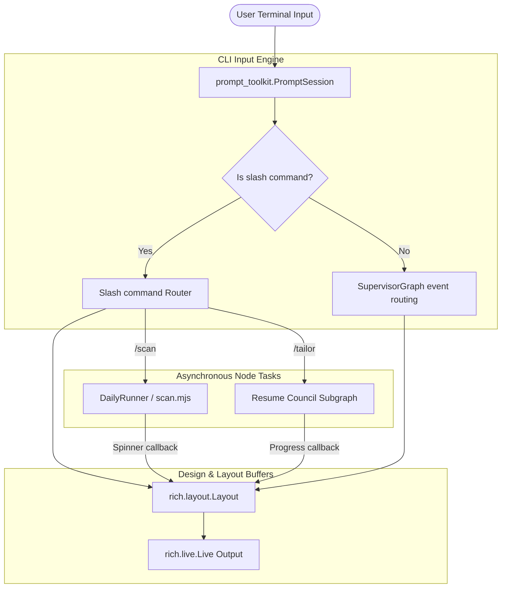

# Implementation Plan — CareerLoop CLI Redesign

This blueprint outlines the technical implementation, aesthetic styling, and functional UX architecture for the **CareerLoop Interactive Terminal (CLI)**. Inspired by state-of-the-art terminal environments like *Claude Code* and *Hermes Agent*, this plan transitions our basic transport loop into a premium, hyper-functional command-line cockpit.

---

## 🎨 Design System & Aesthetics (The Cyberpunk Monochrome theme)

A premium CLI must be visually stunning at first glance. We utilize the Python `rich` library to construct a structured layout that keeps cognitive load low and user state visible.

### 1. Retro-Futuristic Brand Banner
Upon startup, the terminal renders a custom ASCII header in vibrant green and cyan, instantly creating a premium product feel.

```text
 ┌────────────────────────────────────────────────────────┐
 │   ______ ___   ____  ______ ______ ____  __     ____   │
 │  / ____//   | / __ \/ ____// ____// __ \/ /    / __ \  │
 │ / /    / /| |/ /_/ / __/  / __/  / /_/ / /    / / / /  │
 │/ /___ / ___ / _, _/ /___ / /___ / ____/ /___ / /_/ /   │
 │\____//_/  |_/_/ |_/_____//_____/_/   /_____/ \____/    │
 └────────────────────────────────────────────────────────┘
```

### 2. The Dual-Pane Console Grid (`rich.layout`)
Instead of a continuous scrolling wall of text, we partition the terminal screen into a **fixed dual-pane dashboard layout** using a `rich.live.Live` window:

*   **Left Panel (The Status Card - 30% Width):**
    *   Shows active user profile attributes (target cities, notice period, target roles).
    *   Lists the active user state (`ONBOARDING`, `DAILY_BRIEF_SENT`, `PACK_READY`).
    *   Displays scored job counters (e.g., *Scored Jobs: 14 | Scanned Today: 42*).
*   **Right Panel (The Chat & Activity Stream - 70% Width):**
    *   Scrollable terminal buffer rendering conversational outputs inside bordered panels.
    *   Render Markdown text cleanly using `rich.markdown.Markdown`.
    *   Includes animated spinners (`rich.spinner.Spinner`) and progress bars (`rich.progress.Progress`) during background process execution.

---

## 🕹️ Interactive Components & Functional UX

### 1. True Command Hub (Slash Syntax)
The command hub intercepts the input parser. Typing any leading `/` bypasses standard agent routing, executing system operations directly in the terminal:

| Slash Command | Action / Behavior |
| :--- | :--- |
| **`/status`** | Re-renders the global status card, SQLite connection integrity, and pipeline liveness. |
| **`/scan`** | Launches the background job scanner (`node scan.mjs`) inside a live CLI progress bar. |
| **`/pipeline`** | Displays a beautiful, color-coded `rich.table.Table` listing scored jobs and match ratings. |
| **`/profile`** | Opens a collapsible view showing extracted CV markdown, notice period, and target roles. |
| **`/tailor <id>`**| Directly invokes the **Resume Council S7 subgraph** to tailor a package for a specific job. |
| **`/exit`** or **`/quit`** | Clean teardown of database connections and process handles. |
| **`/help`** | Displays a gorgeous double-bordered panel describing shortcuts. |

---

## 📐 Technical Architecture



---

## 🛠️ Step-by-Step Implementation Map

### Phase 1: Core Shell & Auto-Completion (`prompt_toolkit` Integration)
We configure `prompt_toolkit` with standard word completers and keybindings:
*   **Bracketed Paste Natively Enabled**: Bypasses any line-by-line truncation issues, supporting bulk pasting.
*   **Command Auto-Completion**: As soon as a user presses `/`, a drop-down list suggesting `/status`, `/scan`, `/pipeline`, `/tailor` appears inline.
*   **History & Keybindings**: Up/Down arrow navigation for command history. Keybindings (`Alt+Enter` or `Esc+Enter`) to submit multiline text blocks.

### Phase 2: Visual Frame & Skin Engine (`rich` Integration)
Build `careerloop/transport/skin_engine.py` using `rich.layout.Layout`:
*   Establish top brand header, sidebar status columns, and chat frames.
*   Maintain a live stream. Use python `threading` to run background Node.js commands (like `scan.mjs`) asynchronously so the terminal spinner animations remain fully fluid (60fps) and the UI never freezes during scans.

### Phase 3: Scored Job Interaction Dashboard
Redesign the `/pipeline` output to draw an interactive console table:
*   Shows matching percentage in green/yellow/red gradient colors.
*   Provides rapid selection keys:
    *   Type `v <job_id>` to view details in a side panel.
    *   Type `t <job_id>` to trigger council tailoring.
    *   Type `d <job_id>` to dismiss a job.

---

## 🔬 Verification & Live Testing Plan

### Automated Verification
*   **Syntax Check**: Validate correct `prompt_toolkit` word completions and keybindings bindings.
*   **Layout Threading Check**: Run a mockup script to ensure background worker threads update the sidebar state panel without crashing standard output streams.

### Manual Verification
1.  Launch `python3 careerloop/chat_cli.py` in the terminal.
2.  Ensure retro-futuristic ASCII banner is displayed in solid green/cyan.
3.  Type `/` to verify auto-complete popups appear correctly.
4.  Paste a full markdown CV and verify formatting displays inside a rounded cyan box.
5.  Type `/scan` and verify interactive spinner cycles while executing the scan command.
