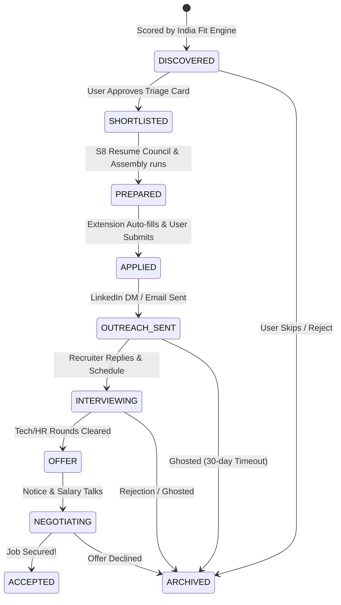

# CareerLoop — Memory Systems Vision & Implementation
## MECE Persistent Data Engine

> [!NOTE]
> **Product Thesis:** *Persistent memory converts single transactions into compounding career leverage.*  
> This memory plan ensures that every application, recruiter response, and interview weakness is preserved, processed, and recursively read back to optimize your positioning.

---

## 📐 The MECE Memory Dimensions

```
┌────────────────────────────────────────────────────────────────────────┐
│                      C A R E E R L O O P   M E M O R Y                  │
├───────────────────┬────────────────────┬───────────────────┬───────────┤
│ D1: PROFILE       │ D2: LIFECYCLE      │ D3: RECRUITERS    │ D4: LOOPS │
├───────────────────┼────────────────────┼───────────────────┼───────────┤
│ * Master CV       │ * State Transitions│ * D1-D5 vectors   │ * QA vent │
│ * Superpowers     │ * Resume mappings  │ * Recruiter loop  │ * Failures│
│ * Notice / Salary │ * Document history │ * Email templates │ * Negotiate│
└───────────────────┴────────────────────┴───────────────────┴───────────┘
```

---

## 🔄 Job State Transitions (D2 State Diagram)

A job begins its life as a raw discovery listing and is dynamically transitioned through standard lifecycle phases based on user approval and real-world milestones:



---

## 💾 Supabase / Postgres Database Schema

These core tables store user state, application bundles, company intelligence, and recruiter contacts persistently:

```sql
-- 1. Central Users Table
CREATE TABLE public.users (
    id UUID PRIMARY KEY DEFAULT gen_random_uuid(),
    email VARCHAR(255) UNIQUE NOT NULL,
    created_at TIMESTAMP WITH TIME ZONE DEFAULT timezone('utc'::text, now()) NOT NULL
);

-- 2. Candidate Profile Memory (D1)
CREATE TABLE public.candidate_profiles (
    user_id UUID PRIMARY KEY REFERENCES public.users(id) ON DELETE CASCADE,
    full_name VARCHAR(255) NOT NULL,
    headline VARCHAR(255),
    master_cv_text TEXT NOT NULL,
    notice_period_days INT DEFAULT 30,
    target_ctc_lpa NUMERIC,
    target_cities VARCHAR(100)[] DEFAULT '{}',
    superpowers TEXT[] DEFAULT '{}',
    updated_at TIMESTAMP WITH TIME ZONE DEFAULT timezone('utc'::text, now()) NOT NULL
);

-- 3. Applications State Ledger (D2)
CREATE TYPE application_state AS ENUM (
    'DISCOVERED', 'SHORTLISTED', 'PREPARED', 'APPLIED', 
    'OUTREACH_SENT', 'INTERVIEWING', 'OFFER', 'NEGOTIATING', 
    'ACCEPTED', 'ARCHIVED'
);

CREATE TABLE public.applications (
    id UUID PRIMARY KEY DEFAULT gen_random_uuid(),
    user_id UUID NOT NULL REFERENCES public.users(id) ON DELETE CASCADE,
    company_name VARCHAR(255) NOT NULL,
    job_title VARCHAR(255) NOT NULL,
    job_url TEXT,
    state application_state DEFAULT 'DISCOVERED'::application_state NOT NULL,
    fit_score NUMERIC(5,2),
    tailored_resume_md TEXT,
    cover_note TEXT,
    outreach_dm TEXT,
    created_at TIMESTAMP WITH TIME ZONE DEFAULT timezone('utc'::text, now()) NOT NULL,
    updated_at TIMESTAMP WITH TIME ZONE DEFAULT timezone('utc'::text, now()) NOT NULL
);

-- 4. Recruiter & Company Network Memory (D3)
CREATE TABLE public.recruiter_contacts (
    id UUID PRIMARY KEY DEFAULT gen_random_uuid(),
    application_id UUID REFERENCES public.applications(id) ON DELETE SET NULL,
    company_name VARCHAR(255) NOT NULL,
    name VARCHAR(255) NOT NULL,
    role VARCHAR(255),
    linkedin_url TEXT,
    email VARCHAR(255),
    contacted_at TIMESTAMP WITH TIME ZONE,
    replied_at TIMESTAMP WITH TIME ZONE,
    notes TEXT
);

-- 5. Interview Interaction Feedback (D4)
CREATE TABLE public.interview_sessions (
    id UUID PRIMARY KEY DEFAULT gen_random_uuid(),
    application_id UUID NOT NULL REFERENCES public.applications(id) ON DELETE CASCADE,
    round_name VARCHAR(255) NOT NULL, -- e.g., "System Design", "HR Screen"
    session_date DATE NOT NULL,
    vent_transcript TEXT, -- Audio transcript from the bot
    questions_asked TEXT[] DEFAULT '{}',
    gaps_identified TEXT[] DEFAULT '{}',
    created_at TIMESTAMP WITH TIME ZONE DEFAULT timezone('utc'::text, now()) NOT NULL
);
```

---

## 🔄 The Compounding ROI Loop

The ultimate value of this MECE Memory system is **recursive self-improvement**:

1.  **Extraction:** During an interview post-mortem in `public.interview_sessions` (D4), the bot extracts that you were rejected at a company because your experience with "PostgreSQL scaling" was perceived as weak.
2.  **Synthesis:** The memory agent registers "PostgreSQL scaling" as a primary gap and appends a positioning correction in `public.candidate_profiles` (D1).
3.  **Application:** The next time S7 Resume Council runs on a new job, the positioning engine pulls the gap notes, shifts the S6 positioning strategy, and automatically highlights your Redis/FastAPI clustering metrics to preempt that specific objection!
